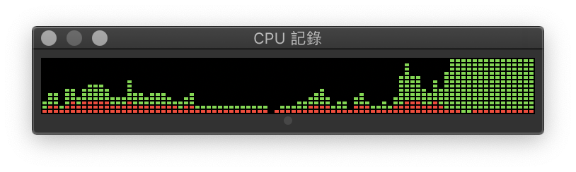

# 1.1 让 CPU 占用率曲线听你指挥

## ★★★

写一个程序，让用户来决定 Windows 任务管理器（Task Manager）的 CPU 占用率。程序越精简越好，计算机语言不限。例如，可以实现下面三种情况：

1. CPU 的占用率固定在 50%，为一条直线；
2. CPU 的占用率为一条直线，但是具体占用率由命令行参数决定（参数范围：1 ~ 100）；
3. CPU 的占用率状态是一个正弦曲线。

## 解

### 死循环

很容易能写出这样的伪代码：

```
while (true) {
    if (/* less than 50% */)
        // do something CPU time consuming
    else
        // don't do anything CPU time consuming
}
```

让 CPU 做事情很简单——可以是一个空循环、做一些没有意义的事情（比如，递增一个变量）。

我们试着写一个死循环程序 `deadloop`（`./src/deadloop.cc`），试着编译并运行。留意到在一台搭载双核四线程 CPU 的机器上，该程序占用了接近 $100\%$ 的 CPU 时间，这符合我们的预期；


> 使用解释性语言 Python 写成的 （`./src/deadloop.py`）也一样可以实现类似的效果。

### 多核心

但是，如果我们观察 Activity Monitor 记录下的实际 CPU 占用率曲线，可以看到它几乎在 $50\%$ 附近波动，并不符合我们的预期。


原因是测试机器的 CPU 具有两颗物理核心，而我们的程序是单线程的。鉴于其不能在多枚核心上运行、只能填满一颗核心的 CPU 时间，所以总的负载记录是 $\frac 1 {Core\ Count}$，也就是 $50\%$。

可以很轻易地用 Python 或是 C/C++ 来实现多线程；但是我们需要获取当前系统的 CPU 物理核心数目，才能决定我们要新增几条线程。

Python 的 `psutil` 库提供了方便且跨平台的封装，方便我们获取这类信息。

在 `import psutil` 之后，只需要简单地调用

```python
psutil.cpu_count(logical=False)
```

就能获取当前 CPU 的物理核心数目了。

> 参见 `./src/corecount.py`。

现在我们只需要把我们的负载（实际上啥也没干）分配到多个核心上就好了。

遗憾的是，CPython 实现借助的 GIL，也就是全局锁使得整个解释器同一时间只能执行来自一个线程的字节码。所以，解释器完全无法同时占用多个 CPU 核心。如果使用 `threading` 库（或者，更早的 `thread` 库），那么并行计算几乎就不可能了。

好在 Python 还提供了 `multiprocessing` 库。顾名思义，这就是用来分散计算任务到多核心的库了。

> 其实 `multiprocessing.cpu_count()` 也是一样能获取 CPU 核心数目。

很好！现在 CPU 时间就被占满了。




可以看到，四个 `multiprocessing` 的核心池。

> 参见 `./src/deadloop_fixed.py`。

### 休息

好了，我们已经有能力占满 CPU 了。现在我们要做的就是在合适的时候休息，停止这样占用 CPU 时间。

我们怎么才能不占用 CPU 时间呢？

很简单，要么在等待用户输入（比如，调用了 `input()` 函数要求用户输入）、要么在等待某些事件发生（如中断、系统信号）、要么主动进入休眠状态（如调用 `sleep()` 函数）。

在这里我们就直接调用 `sleep` 函数，休息一段时间就好了。

在每次醒来之后，根据当前的 CPU 占用率来决定是继续休息，还是进行死循环。

注意不能休息太久，否则 CPU 时间更新不及时，会出现漂移；也不能休息时间太短，否则频繁地唤醒、挂起线程会带来不稳定性。

10 毫秒是一个不大不小的数值，比较接近 Windows 的最小调度时间片。因此我们就这么写：

```python
import time

time.sleep(0.01)
```

遗憾的是，假如我们直接这么写

```python
while True:
  	if busy:
      	sleep(0.01)
```

会导致我们的大部分时间都用在 Jump 上面，而导致实际上进行的运算不足。

既然我们发现「CPU 使用率太高了」的时候，会连着休息 10 毫秒；那么我们在发现「CPU 使用率不够」的时候，就得连续工作 10 毫秒。

我目前的机器主频率是 3.5 GHz。也就是说，一秒钟会执行 3500000000 个循环。

把我们上面的 C 代码反汇编一下可以看到，循环体里面的指令长度是 4。

```assembly
100000fa2:	8b 45 f8 	movl	-8(%rbp), %eax
100000fa5:	83 c0 01 	addl	$1, %eax
100000fa8:	89 45 f8 	movl	%eax, -8(%rbp)
100000fab:	e9 f2 ff ff ff 	jmp	-14 <_main+0x12>
```

现代处理器通常在一个 Cycle 里可以执行 2 条指令，因此我们可以粗略地估计，每秒钟能够执行的循环个数是 3500000000 × 2 ÷ 4 ≈ 1,750,000,000 个。

那么，对应地，10 毫秒内执行的循环个数是 17500000 个。用这个来测试一下，即「冻结」的时间长度和「工作」的长度基本类似，我们就可以得到比较合理的结果。

留意到 Python 作为解释性语言，效率一定低于编译的汇编。所以如果我们直接照搬 C 的实现，就会导致工作时间过长，从而产生相当不稳定的跳变。


因此，我们选择适当按比例降低 Busy Loop 的循环个数，以便适应 Python 的慢速。


能得到一个勉强可用的效果。

### 灵活适配

上面，我们的 Busy Loop Cycle 是硬算出来的；这样算出来的结果无法自适应不同的计算机。

解决方法也很简单：`psutil.cpu_freq()` 函数就能获取 CPU 的主频率；然后按照一样的办法计算 Cycle 数就好了。

> 参见 `./src/dynamic_adjust.py`。

### C++: 获取频率和周期数

获取频率很简单：调用 `powerbase.h` 里的 `CallNtPowerInformation` API 即可得到频率。

只要用 `rdtsc` 指令就能获取特定指令之间的 CPU 运行周期数了。

x86 上可以直接内联汇编：

```c++
inline __int64 GetCPUTickCount()
{
    __asm
    {
        rdtsc;
    }
}
```

x64 更简单：

```c++
#define GetCPUTickCount() __rdtsc;
```

曾经一度 `rdtsc` 成为了用于高精度低成本计时的标准，或是用于优化的 Benchmark。

然而现在的 CPU 频率可能变化、多核的 TSC 未必同步、乱序执行还会导致测量周期数不准确。

我们的 Thread 都被 Mask 固定在某一特定核心上，所以这里问题不是很大。

### C++: 指定处理器

如果要在 C++ 下实现多核支持，我们可没有现成的 `multiprocessing` 库可以用。

但是，Windows API 也提供了

```c++
DWORD_PTR SetThreadAffinityMask(HANDLE hThread, DWORD_PTR dwThreadAffinityMask); 
```

可以指定 Thread 在哪个 CPU 核心上运行。

使用 `GetProcessorInfo()` 就能获取 CPU 的信息；然后开 $n$ 个线程、并设定其 CPU 运行掩码即可实现类似于 pool 的效果。

### 命令行参数

附加题一就是允许使用命令行参数动态调整目标 CPU 占用率。

这并不难——一开始就没有写死。

直接用 `sys.argv` 来获取参数列表，就好了。

> 参见 `./src/param_arg.py`。

### 正弦函数

留意到，我们不可以用循环来计算正弦函数。因为咱们的每个线程都可能随时中断（Idle），并不能保证总是得到相等的时间片段，画出来的结果可能会变形。

解决方法也很简单——每次用系统时间来作为函数的自变量。由于系统时间的流动一定是均匀的，所以最后画出来的结果也一定是关于时间均匀的。

好办的。

> 参见 `./src/sample_sine.cc`。

### 跋

最后的结果，还是不太平滑流畅。

果然，Python 的解释执行还是不太稳定的。

## Replacement of `rdtsc`

`rdtsc` 不好使了。但是替代方案还是有的。

Windows 下的 `QueryPerformanceCounter` 和 `QueryPerformanceFrequency`。

POSIX 下的 `clock_gettime`，都是可以高精度计时的。

## Acknowledgements

* https://zhuanlan.zhihu.com/p/24311810

* https://docs.microsoft.com/en-us/windows/win32/api/powerbase/nf-powerbase-callntpowerinformation
* https://blog.csdn.net/solstice/article/details/5196544