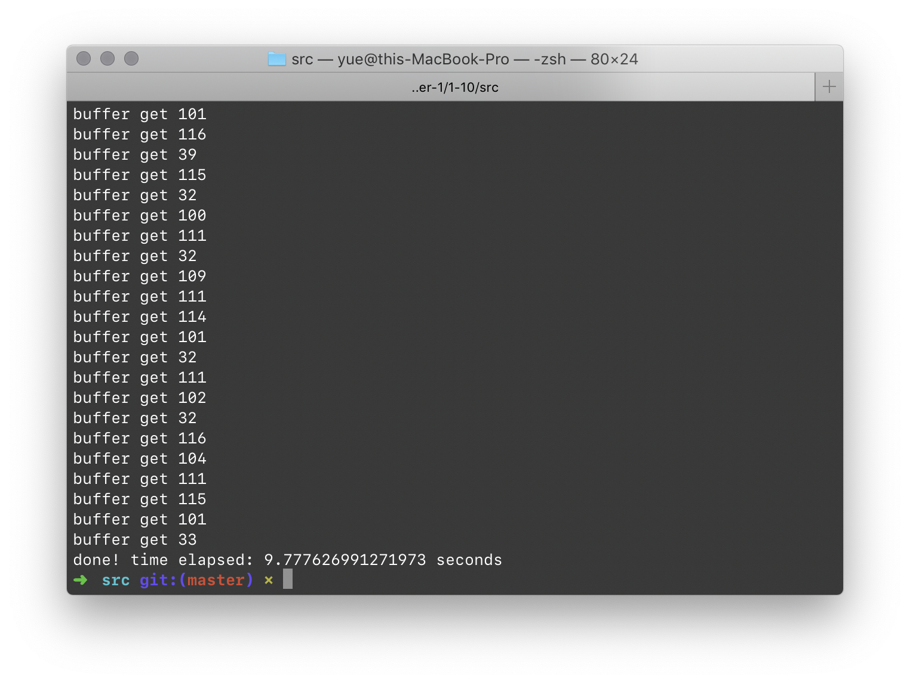
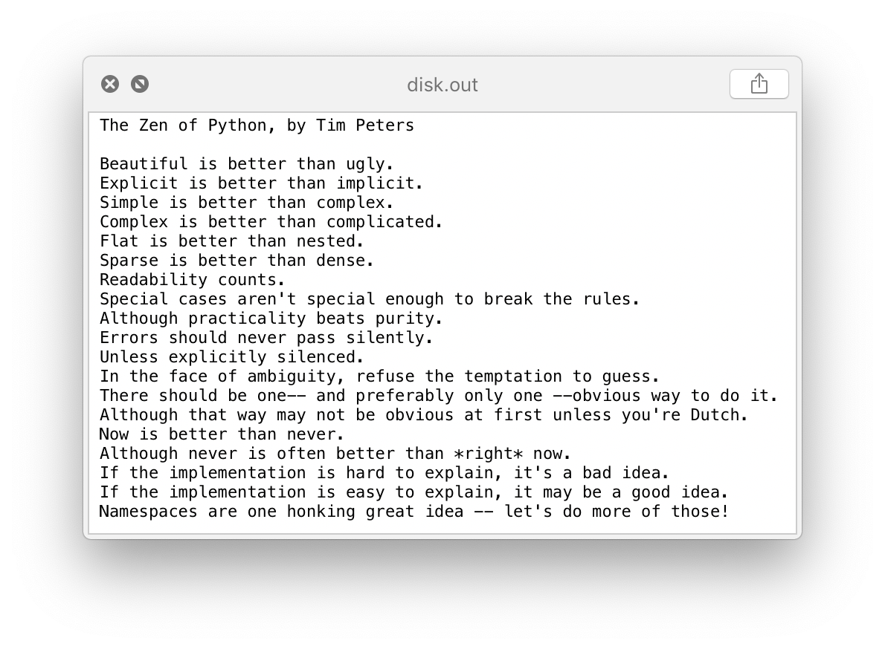
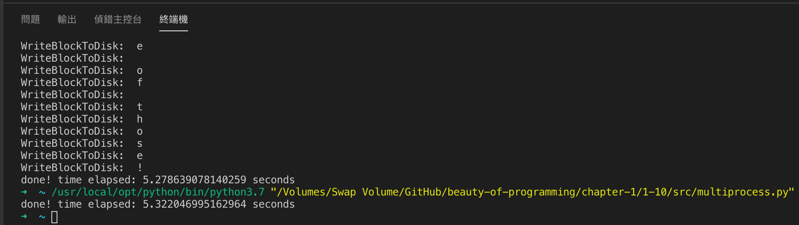
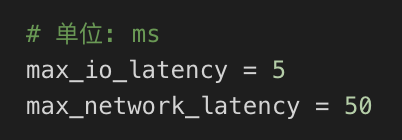
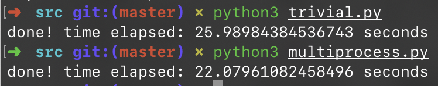

# 1.10 双线程高效下载

## ★★★

我们经常需要编写程序，从网络上下载数据，然后存储到硬盘上。一个简单的做法，就是下载一块数据，然后写入硬盘，然后再下载，再写入硬盘……不断重复这个过程，直到所有的内容下载完毕为止。能否对此进行优化？

不妨对问题进行一些抽象简化：

1. 假设所有数据块的大小都是固定的。
2. 可以使用一个全局缓冲区 `Block g_buffer[BUFFER_COUNT]`。
3. 假设两个基本函数已实现（且正常工作、不会抛出异常）。

```c++
// downloads a block from Internet sequentially in each call
// return true, if the entire file is downloaded, otherwise false
bool GetBlockFromNet(Block* out_block);

// writes a block to hard disk
bool WriteBlockToDisk(Blcok * in_block);
```

那么，我们的简单单线程代码可以这么实现：

```c++
while (true)
{
    bool isDownloadCompleted;
    isDownloadCompleted = GetBlockFromNet(g_buffer);
    WriteBlockToDisk(g_buffer);
    if (isDownloadCompleted) {
        break;
    }
}
```

可以看到，在上述的方法中，我们需要下载完一块数据之後才能写入硬盘；换句话说，这个过程是串行的。为了提高效率，我们希望能够设计两个线程，使得下载和写入能够并行进行：

线程 A：到网络中读取一个数据块，存储到内存的缓存中。

线程 B：从缓存中读取内容，存储到文件中。

试实现如下子程序：

* 初始化部分
* 线程 A
* 线程 B

可以使用下面的多线程 API：

```c++
class Thread
{
public:
    // initialize a thread and set the work function
    Tnread(void (*work_func) ());
    
    // once the object is destructed, the thread will be aborted
    ~Thread();
    
    // start the thread
    void Start();
    
    // stop the thread
    void Abort();
}

class Semaphore
{
public:
    // initialize semaphore counts
    Semaphore(int count, int max_count);
    
    ~Semaphore();
    
    // consume a signal (count--), block current thread if count == 0
    void Unsignal();
    
    //raise a signal (count++)
    void Signal();
}
```

如果网络延迟为 $L_1$，磁盘 I/O 延迟为 $L_2$，将此多线程实现与单线程实现进行比较，分析这个设计的性能问题，考虑是否还有其他改进办法？

## 移植

上面的多线程、信号量都是 C/C++ 风格的 API。

先糊一个 Python 版本的吧。

### Basic Functions

首先，实现两个基本函数 `GetBlockFromNet` 和 `WriteBlockToDisk`。都是模拟的：前者从一个字符串里每次读取一个字符传回，後者将传入的字符附加到 `disk.out` 文件中。

当然，两个函数都加了锁。

为了模拟真实情况，每个函数执行过程中会随机 `sleep` 0 到 10 毫秒。

> 参见 `./src/basic_utils.py`。

### Trivial Implementation

把上面的串行实现抄过来，是这样的：

```python
#!/usr/bin/env python

from basic_utils import *

buffer = Block('\0')

while True:
    isMoreBlockLeft = GetBlockFromNet(buffer)
    print("buffer get", buffer.content)
    WriteBlockToDisk(buffer)
    if isMoreBlockLeft:
        break

print("done")
```

> 参见 `./src/trivial.py`。
>
> 这里的 `GetBlockFromNet` 在还有更多 Block 时返回 True，在没有更多 Block 时返回 False。这和上面 C API 的语义不同。





可以看到，工作正常。 

### Special Notes

CPython 的实现依赖于一个全局解释锁（GIL），这就是说所有早期的多线程库（包括 `thread` 和 `threading`）都是伪多线程，实际上无法利用多个 CPU 核心。

使用更新的 `multiprocessing` 库来解决这个问题。她可以真正将计算任务分散到多个核心中。

## 解

### Analysis

在这里，我们要重点考虑下面几件事情：

* 何时才算完成任务？
  * 两个线程协同工作，将网络上的数据下载完毕，且完全存储到硬盘上之後，两个线程才能正常终止。
* 为了提高效率，两个线程最好尽可能可以同时工作。
  * 如果使用 Mutex（互斥锁），下载和存储线程将不能同时工作。
  * 因此，Semaphore（信号量）会是更好的选择。
* 下载和存储线程工作的必要条件？
  * 如果共享缓冲区满了，就应该暂停下载进程。
  * 如果下载内容已经结束，就应该终止下载进程。
  * 如果共享缓冲区空了，就应该暂停存储线程。
* 共享缓冲区的数据结构？
  * 很重要的，必须符合 FIFO（First in First Out），即「先进先出」原则。Block 进入缓冲区的顺序必须和最终写入硬盘的顺序一致。
  * 这种 FIFO 策略让我们想起了「队列」数据结构。考虑到我们采用了缓冲空间来存储下载内容，循环队列应该可以用来存储。

### Multiprocessing

根据上面的讨论，很容易写出基于信号量、循环队列的代码。

注意，这里用了 `multiprocessing` 库里的 `Queue` 和 `Value` 对象进行进程间的数据交换。



可以看到，时间大大缩短了。

> 参见 `./src/multiprocess.py`。

### Optimization

通常来说，网络延迟会远远大于 I/O 存储延迟。

我们来试着测试一下在下面的延迟配置下，上面两种算法的表现。





可以看到，在网络延迟较大的情况下，简单的 A + B 多线程效果没那么好了。

这时我们增加网络请求的线程数量应该会有很不错的效果…这里就不写了。

