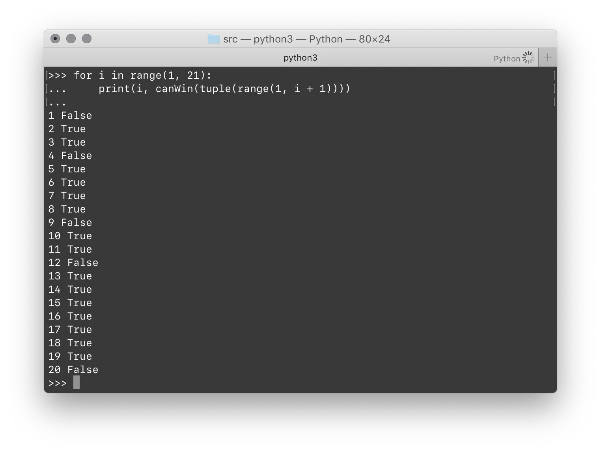

# 1.11 Nim 之一：一排石头的游戏

## ★

$N$ 块石头排成一行，用 $1$ 到 $N$ 的 ID 进行标记。每块石头按照其 ID 从小到大依次排开。两个玩家依次取石头。每个玩家可以从这一列石头中随机取走其中任意一块石头，或者 **ID 相邻**的两块石头。

> 注意是 ID 相邻，而不是物理相邻！
>
> 例如，在石头 3 被取走之后，就不能再同时取走石头 2 和 4。虽然他们在一排石头中仍然相邻，但 ID 不相邻。所以不能一次拿走他们。

石头在游戏过程中不能改变相对顺序。最後能将剩下石头一次取光的玩家获胜。

这个游戏有必胜策略吗？

## 解

### Thoughts

首先，这个游戏的最终情况只有两种：要么赢要么输。而且，在每种情景下，玩家所能进行的操作是有限的。（在剩余 $k$ 块石头的情况下，有 $2k - 1$ 种选项可以选择。）况且，也不存在任何随机因素。

因此可以从最终情况的「必胜与否」依次向前推导，直到最开始的情况——要么是必赢，要么是必输。

递归试试看吧？

### Trivial Solution

先写一个愚蠢版本，作为基准吧…

简单说，在每一种情况出现时，穷尽地遍历每一种情况。

注意对于每个玩家而言，如果所有可能的操作最终都指向输，那么这一步就完全输。但只要有一步可能的操作指向赢，那么这一步就可以赢。

> 这个在附加题中很重要！

> 参见 `./src/trivial.py`。

写出代码之後，跑了跑试试看，发现似乎不论 $N$ 取多少，结果都指向 True。即，先取者总是能赢。怎么会这样？

### Mathematical Solution

咱们从数学的角度研究一下。

* 在石头数量 $N = 1$ 和 $N = 2$ 时：
  * 先取者可以一次取完所有石头获胜。
* 在石头数量 $N = 3$ 时：
  * 如果先取者拿走石头 1、石头 3、石头 1 + 2、石头 2 + 3，剩下的局面都是下一手就被全部拿走。
  * 但是，如果先取者拿走石头 2，後取者就别无选择地在下一手剩下一块石头，也就是先取者赢了。
* 在石头数量 $N = 4$ 时：
  * 先取者如果拿走石头 2 + 3，那么後取者就只能拿走 1 或石头 4，一定剩下一块。先手赢了。
  * 如果取走了边上的石头 1 或石头 4，那么局面退化到了 $N = 3$ 的情况——不过这次先手变成了後手。别这么取！
* 在石头数量 $N \gt 4$ 时：
  * 先取者只要拿走最中间的石头（视 $N$ 的奇偶性，可能需要取走一块石头或两块连续的石头），随後只要按照对手的方式拿走与他对称的石头，就一定能保证每次有石头拿，且最後一块石头一定是先手拿走的。

综上，先取者总是必胜的！

> 参见 `./src/math.py`。

## 附

上面这题没什么意思。假如修改一下规则，「最後取光石头的人输」，该怎么办呢？

### Trivial

直接把判断语句反置就好了。

```python
    if len(stones) == 1:
        # One single stone left
        return False
```

另外，还需要修改一点逻辑：在仅剩两块 ID 相连石头的时候，按照上面的逻辑就直接取走就赢了。可现在，直接取走是输的，所以不能直接在这里短路了。

可以看到结果不是那么无趣了：胜负手开始有点意思了。



参见 `./src/extra.py`。

## 附 2

若两个人轮流取一堆石头，每人每次最少取 $1$ 块石头，最多取 $K$ 块石头，最後取光石头的人赢。判断先手胜负性。

> 这里没说清楚到底是这 $1$ 到 $K$ 块石头要不要连续。不过总归…就这样吧。
>
> 写法没什么大区别。

## 跋

上面的 Nim 游戏都是弱化版…真正的 Nim 在 1.12 才刚刚开始。