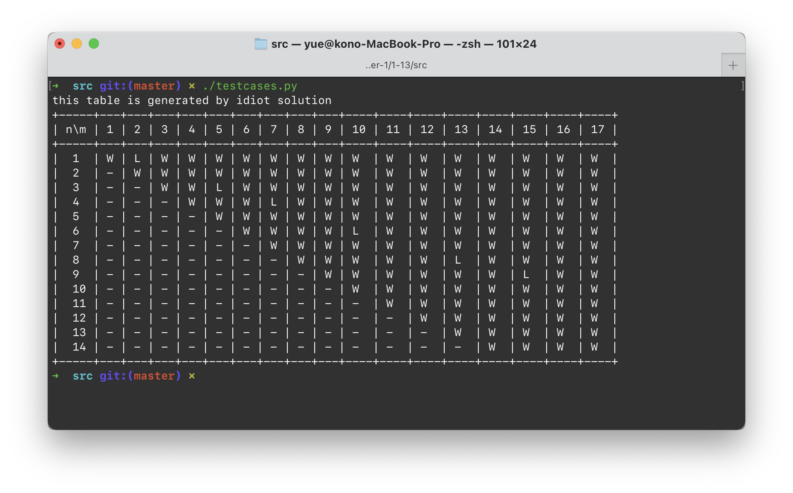
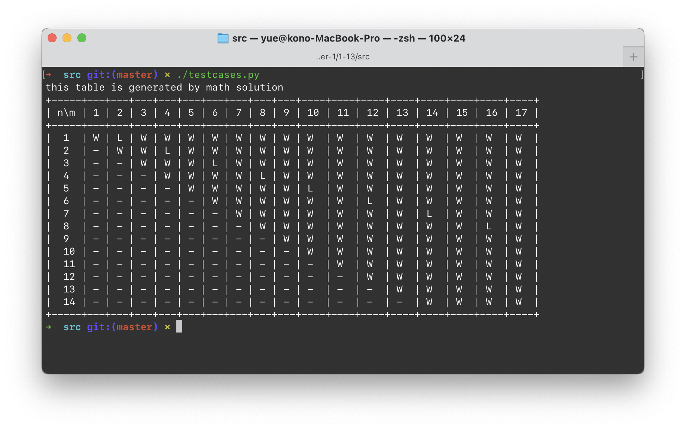

# 1.13 Nim 之三：两堆石头的游戏

## ★★★

在前面两个题目中，我们讨论了被称为「Nim」（拈）的这种游戏及其变种的玩法和必胜策略。下面我们将讨论这类游戏的另一种有趣玩法。

假设有两堆石头，有两个玩家会根据如下的规则轮流取石头：

* 每人每次可以从两堆石头中各取出数量相等的石头，或者仅从一堆石头中取出任意数量的石头。
* 最後把石头一次性拿光的人获胜。

写出一个函数 `bool nim(size_t n, size_t m)`，其中 `n` 和 `m` 分别指明了两堆石头的数量。确认此状态下的先手玩家能否取得胜利。

## 解

### Main Idea

首先，如果 `m` 和 `n` 中的一个等于 0（当然，不能全等于 0，不然那就没有游戏玩了），那么显然此时她必胜。直接将不为空的那一堆拿走，就好了。

其次，如果两堆石头的数量相等，那也很好，可以一次性将他们拿光，从而取得胜利。

但在这两种情况之外呢？该怎么决定拿走的策略？

### Idiot Solution

对最後一个问题，我们回答「每种可能的拿取策略都试一试好了」。

> 注意这里有一些情况是不需要尝试的，例如「拿光其中的某一堆」、或者「拿掉某一些使得两堆石头的数量相等」。
>
> 但是简单起见，不写这些了。

> 另外，非常明显地，子问题会被多次求解。因此采用 Cache 手段把他们缓存起来。最多也只有 $O(mn)$ 的空间而已，没有关系。

```python
# cache size won't exceed N * M
@lru_cache(maxsize=None)
def nim(n: int, m: int) -> bool:
    if n == 0 and m == 0:
        # this case might never be reached
        return False
    elif n == 0 or m == 0:
        return True
    elif n == m:
        return True
    else:
        for take_n in range(1, n - 1):
            if not nim(n - take_n, m):
                return True

        for take_m in range(1, m - 1):
            if not nim(n, m - take_m):
                return True

        for take_both in range(1, min(n, m) - 1):
            if not nim(n - take_both, m - take_both):
                return True

        return False
```

很轻易的思路；同时，每次迭代都能够减小 `m` 和 `n`，因此总体时间复杂度应该是 $O(\max\{m, n\})$ 级别的。

> 实际上，因为这张表一定是对称的（两堆石头地位相同），所以下半角的情况就省略了。



这样就可以了。

### Sift Solution

还记得埃拉托斯特尼的质数筛法吗？在一个有限的顺序数列 $[2, \dots, N, N + 1]$ 中，要找出所有的质数，我们只需要从左到右研究数字 $i$，并在表中删除等于其整数倍的数，就好了。

同样的，在这里我们知道所有的「$n = m$」局面对于先取者都是必胜的。为了称呼方便，我们将其叫做「安全局面」。反过来，先取者必输的局面成为「不安全局面」。

> 这种游戏不存在「先取者必胜」和「必败」以外的情况。

那么很显然，拿走石头的规则决定了（在这张 DP 表中）我们只能沿着水平、垂直、或者斜对角线方向移动。如果能移动到某一个「先取者必败」的局面（就是把这个局面送给了对手），那你就赢了呀。

> 其实这和 Idiot Solution 是类似的思路，只不过 Idiot Solution 没有显式地构造这么一张 DP 表。

另外，因为「取完之後某一堆石头数量为 0」这种情况是绝对的输，所以可以不考虑这种情况。DP 中也没有画这一行和这一列。

> 实际上和做成一张元素为 Bool 的 DP 表没有本质区别。

但是，筛完之后剩下的元素必定不会出现「位于同一行、同一列、同一对角线」的情况（因为这些情况可以相互转换、易攻守之势）。

第 $n$ 组不安全局面的组合 $(a_n, b_n)$ 可以这么计算得到：

* $(a_1, b_1) = (1, 2)$。
* $a_n$ 定义为大于 $a_1, b_1, a_2, b_2, \dots, a_{n - 1}, b_{n - 1}$ 的最小整数。
* $b_n = a_n + n$。

原文给的代码是 C# 写的（不愧是微软的书啊）。参见 `./src/sift.cs`。

> 关于有没有必要在这种时候进行这样的优化…或许有。
>
> 但是，这种「优化」、连带 `n`、`addition`、`delta` 等糟糕的变量命名（基本跟没有名字一样），把整个算法的结构弄得不明不白。代码是难懂的，即便写了注释。

另外，实际上代码中用到的 `ArrayList`，仅仅用到了其中的 `.Add`、`.IndexOf` 方法、而且仅仅对 `.IndexOf` 的返回值做了是否等于 `-1` 的判断。

换言之，这就只是把它当做一个 Set 在用啊。

如果用集合来实现，那么 `.IndexOf(...) == -1` 可以直接用 `.Contains()` 代替，而且为了减小 `IndexOf` 耗时所做的、拙劣的 `ShrinkArray` 也不必要了；因为 Set 的 `Contains` 可以在 $O(1)$ 时间内完成，无论集合有多大。

> 这真是一个有点糟糕的实现…

用 Python 改写了一下，（大概）更清晰了一点吧。参见 `./src/sift.py`。

另外，原文实现有 Bug，会错误地将一部分安全情况划分为非安全情况。（例如，$(3, 5)$ 是非安全的，那么 $(4, 5)$ 就一定是安全的；但是原算法将其也纳入了非安全情况。）错误在「判断是否为非安全情况」的 41 行，将 `x != y - n + 1` 写成了 `x != n`。

> 为什么本该是 `n` 的 Offset 值却变成了 `n - 1`？因为循环中（不知怎么的）作者想要用 `++n` 和 `n++` 这种糟糕简略手法，成功把自己（连带读者）搞晕了。

第二个 Bug 是 `m > n`（`y > x`）的时候算法就直接弃疗了，不管什么都给返回 True。

> 因为算法以 `x` 为标的来计算危险情况列表，但是如果 `y` 比这个危险列表值中最大的还大，那就完全覆盖不到任何危险情况了；自然就是全 True。

> 已经懒得改了…作者你开心就好…


### Mathematical (?) Solution

#### Coding

其实，看一下安全情况的表，大概都能猜得出来规律了…

* $(1, 2)$
* $(3, 5)$
* $(4, 7)$
* $(6, 10)$

* $\dots$

两边合起来就是全部的正整数，且不重复。

对两个数求差，可以得到：

* $2 - 1 = 1$
* $5 - 3 = 2$
* $7 - 4 = 3$
* $10 - 6 = 4$
* $\dots$

这个在之前的通项公式中已经蕴含了。

可以证明，算法的通项公式是：

* $a_n = \lfloor a \times n \rfloor$，其中 $a = \dfrac {1 + \sqrt{5}} 2$；
* $b_n = \lfloor b \times n \rfloor$，其中 $b = \dfrac {3 + \sqrt{5}} 2。$

> 古怪，古怪。

用代码实现是这样的：

```python
import math

def nim(x: int, y: int) -> bool:
    if x == y:
        return True
    if x > y:
        # ensure x <= y
        x, y = y, x
    a = (1 + math.sqrt(5)) // 2
    b = (3 + math.sqrt(5)) // 2

    n = 1
    # 这里本来可以用二分搜索的。
    # 但是懒得写了。

    while True:
        X = int(math.floor(a * n))
        Y = int(math.floor(b * n))
        if X == x and Y == y:
            # 落入危险境地
            return False
        elif X > x and Y > y:
            # 成功渡过难关
            return True
        else:
            # 陷入下一个轮回
            n += 1
            pass
```

> 书中的代码又有问题。寻找 `n` 的代码直接丢了。太糟糕了。
>
> 改过之後的代码在 `./src/mathh.py`。



作为一个数学解，这个算法是没问题的。

作为 Python（以及其他绝大多数计算机程序语言）算法来说，`sqrt(5)` 是无法被他们精确表示的；结果就是当 `x` 和 `y` 很大的时候，这个算法会出错。

> 我不承认这是「数学解」。

书中说这个算法的时间复杂度是 $O(1)$。我认为有点问题。因为的确是可以通过 $O(1)$ 的时间输出第 $n$ 组危险情况的「近似值」，然而没有一个很好的办法确认给出的 $(x, y)$ 究竟是不是落在这一情况里。

> 实际上可以通过反复倍增、直到逼近的方法来找出那个 $n$，这样的时间复杂度就落回了 $O(\log n)$。这还是在不考虑精度问题的情况下。

如果把这个算法实现在 Mathematica 的 Wolfram Script 形式化语言的基础上，或许还能行。

但这就好像「要你求斐波那契数列的第 $n$ 项，用通项公式代入」一样愚蠢。谁都知道，那些 $n$ 阶根号计算机没法精确地表示，而且误差越放越大，最後大过整数间隙是很有可能发生的。

要是想精确计算，那还是落到矩阵乘上了。这不是很可笑吗？

#### Proof

数学证明很容易。

##### Lemma #1

先证引理。上面是作为「观察结论」得出的。

* 所有的不安全局面对 $(a_n, b_n)$ 都满足 $a_n + n = b_n$，而且$a_n = \min\{N - A_{n - 1} \cup B_{n - 1}\}$。

用数学归纳法证明。

* $n = 1$ 时显然成立。

	* 此时的不安全局面对是 $(1, 2)$。

* 假设 $n < k$ 时结论成立（$k \gt 1$）。

	* 记 $a_k = \min\{N - A_{n - 1} \cup B_{n - 1}\}$。
	* 显然，$(a_k, x)$ 对任何 $x \le a_k$ 都是安全局面。
		* $x = a_k$时，直接拿走了。
		* $x \lt a_k$ 时，可以通过拿走 $a_k$ 那堆石头，规约到对手先手的不安全局面。
	* 而 $(a_k, a_k + x)$ 对任何 $x \le a_k$ 也是安全局面。因为可以从两堆石头中同时取走 $a_k - x$ 颗石头，达到较小的一个不安全局面 $(a_x, a_x + x)$。
	* 同时，$(a_k, a_k + k)$ 也是不安全局面。
		* 如果从 $a_k$ 堆中取走 $a_k - x$ 块石头，剩下来的 $(x, a_k + k)$ 对对手来说时安全局面。
		* 如果从 $a_k + k$ 堆中取，只能到达安全局面；因为 $(a_k, x)$ 和 $(a_k, a_k + x)$ 都安全。对对手安全，就是对自己危险。
		* 如果从两堆中都拿走 $x$ 块石头（$x \le a$），剩下的 $(a_k - x, a_k + k - x)$ 也一定是安全局面。因为所有的不安全局面都已经在 $a_{i}, i \lt k$ 中列出了。
	* 从而，$(a_k, a_k + x)$（$x \gt k$）是安全局面。
		* 因为可以从第二堆中取走 $x - k$ 块石头，回到第三种不安全情况。

	综上，引理成立。

##### Lemma #2

如果正无理数 $a$、$b$ 满足 $\dfrac 1 a + \dfrac 1 b = 1$，那么 $\{\lfloor a \times n \rfloor\ | n \in N \}$ 和  $\{\lfloor b \times n \rfloor\ | n \in N \}$ 是 $N$ 的一个分划，即他们没有交集、而且并集就是 $N$。

> 这个定理不证。

因此，取出两个无理数 $a$、$b$ 满足 $\dfrac 1 a + \dfrac 1 b = 1$，他们成就一个分划 $A_n$ 和 $B_n$。

只有这个条件无法确定 $a$ 和 $b$。我们进一步设定 $B_n = A_n + n$，即对应到每个 $n$ 上，有 $\lfloor b \times n \rfloor = \lfloor a \times n \rfloor + n = \lfloor (a + 1) \times n \rfloor$。

对于所有的 $n \in N$ 都要成立，因此必须有 $b = a + 1$。

联立
$$
\left\{  
             \begin{array}{**lr**}  
             \dfrac 1 a + \dfrac 1 b = 1  \\  
            b - a = 1   
             \end{array}  
\right.
$$
解得
$$
\left\{  
             \begin{array}{**lr**}  
             a = \dfrac {1 + \sqrt{5}} 2  \\  
            b = \dfrac { 3 + \sqrt{5}} 2 
             \end{array}  
\right.
$$
因此得到原式的通项公式。

## 附

要求出「必胜」的手法？这个简单；对于 Idiot Solution 来说，直接查阅 DP 表就可以得到结果了。

当然，必胜策略不唯一——但是共同的目的就是落到一个「必输策略」中；也就是，往上、往左、往斜对角线上的「必输情形」走。

> 如果赶时间呢，就找那个跨度最大的地方走，这样能尽快地结束游戏。
>
> 如果不赶时间想跟他慢慢玩，那可以往比较靠近的地方走。
>
> 如果你爱你的对手，想故意输给她，那也可以把她往「安全地带」送。

## 跋

首先，这题目出得太刻意；规则太复杂，而且先手优势太大。并且，没有拿石头的上限，游戏玩不了几手就得结束。

> 我觉得大家不会喜欢玩这个游戏的.jpg

另外，书中给出的两个解答 各 有 千 秋（问题多多）。

第一个 SIFT 算法，程序写得一塌糊涂，优化（这个算优化吗？）嵌入程序逻辑导致难懂，而且还有不成熟的劣化（指该用 Set 不用却用 ArrayList）。

第二个数学算法，数学部分倒是很不错，很可惜写成程序就有问题了——谁能精确表示 $\sqrt{5}$ 啊！结果就是 $n$ 一大，就爆炸。

> 更别提书里的代码还一堆 Bug 了…

总归，这一节读得很憋屈…

> 反倒是一开始写的 Idiot Solution 看起来最正常…