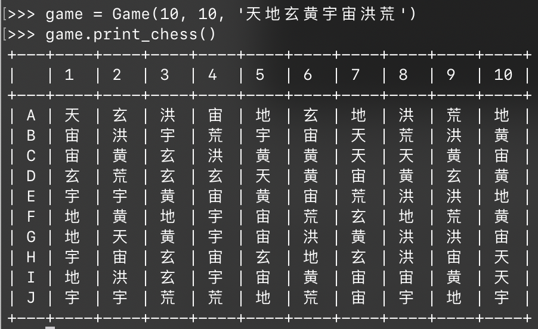

# 1.14 连连看游戏设计

## ★★

连连看是一种很受大家欢迎的小游戏。MSRA 的实习生们就曾经开发过一个类似的游戏——Microsoft Link-up。

下图是 Microsoft Link-up 的一个截图。如果用户可以把两个同样的图用线（连线拐的弯不能多于两个）连到一起，那么这两个头像就会消掉。当所有的头像全部消掉的时候，游戏结束。

假如让你来设计一个「连连看游戏」的算法，你会怎么做呢？要求说明：

1. 怎么用简单的模型来描述这个问题？
2. 怎么判断两个图形之间是否可相消？
3. 怎么求出相同图形之间的最短路径（转弯数最少、其次经过的格子数目最少）？
4. 怎么确定死锁状态（任意两个头像之间都无法相消）？如何设计算法来解除死锁？

## 解

### Game Model

首先咱们抽象地定义一个 Link-up 游戏模型：

```python
#!/usr/bin/env python3

class Game:
    
    chessboard: list

    def __init__(self, width: int, height: int, shapes: str):
        # initialize the game

        # chessboard must contains even number grids!
        assert(width % 2 == 0 or height % 2 == 0)

    def shuffle(self):
        # randomly shuffles the chessboard
        pass

    def is_dead_lock(self) -> bool:
        # check if it's a dead lock situation
        pass

    def is_game_over(self) -> bool:
        # check if the game is over
        pass

    def try_link(self, since: (int, int), till: (int, int)) -> bool:
        # tries to link two grids

        assert(since != till)

        # returns True if they can be linked-up, and updates the chessboard
        # returns False if can't
        return True
```

基础的方法就这么多。

> 简单起见，每个连连块的「符号」直接用一个字符来表示。
>
> 所有「块」用嵌套的 List 存储。
>
> > 不要吐槽我的垃圾实现！
>
> 已经被消去的块采用 None 填充。

### Implementation

#### Over?

最简单的实现应该就是 `is_game_over` 了。

```python
@methodof(class=Game)
def is_game_over(self) -> bool:
    # check if the game is over
    for row in self.chessboard:
        for tile in row:
            if tile != None:
                return False
    return True
```

#### Print!

以及，实现一个打印棋盘格局的函数，方便我们调试：

```python
from prettytable import PrettyTable

@methodof(class=Game)
def print_chess(self):
    table = PrettyTable(field_names=[''] + list(
        range(1, len(self.chessboard[0]) + 1)))

    row_idx = ord('A')
    for row in self.chessboard:
        table.add_row([chr(row_idx)] + row)
        row_idx += 1
        print(table)
```


#### Init

然後，我们需要把每个格子中填上对应的字符。不过注意，每个字符一定需要成对，否则玩家没法玩。

这里采取的策略是：生成所有位置对应的 `(x, y)` 对，将其 Shuffle 打乱，然後从头到尾两个两个一起随机指派花色。



生成结果很不错。

#### Shuffle

连连看「打乱」的策略是：尚未被消去的块位置不能改变；但是花色会改变。

因此，我们需要把花色提取出来，然後做一次随机指派。


> 其实 Init 也可以复用 Shuffle 代码的…但是我懒了。算了吧。

#### Link!

终于要开始连连看了。

问题来了：如何判断两个块之间能否在小于三次拐弯的情况下连接？这里我们可以试一试广度优先搜索。

实际上，每个块小于三次拐弯可以抵达的位置是有限的。只要做两次深度搜索，问题就解决了。


完成这一步基本就可以玩了。

> 这里因为不需要画出「最短路径」，只要找出「最少转折数」，因此简单的 BFS 就足够了。

#### Dead-Lock?

最简单的策略就是，检查每个格子，两两将其配对，观察是否可消去。

但是，有可能两个格子目前是无法消去，再其他格子消去之後又可以消去了（即存在依赖性）。因此，必须进行 $\dfrac {mn} 2$ 次尝试才能确认其是否会死锁。

> 这个复杂度就真的很爆炸了…

### Idea

有另一种思路，即保存每个局面下，两个格子之间的最短路径来实现快速的搜索。

> 这样就需要 $O(m^2n^2)$ 的空间占用了…

这样的问题就是：几乎用户的每次操作都会刷新整个局面；如果更新局面的代价太大，那么这么做就不太值得了。

## 跋

在围棋和象棋游戏之中，经过若干个步骤之後可能回到一个曾经出现过的状态（如，围棋的「劫」）。如何对其进行检测？

根据 Herb Sutter 的说法，国际象棋每个局面的（上下文无关）编码大概需要 32B。一局典型的 80 半步棋局只需要消耗 2 KiB 左右内存。

围棋的局面描述起来更为简单：$19 \times 19 = 361$ 个落子位置，每一个局面可以上下文无关地用不超过 90 Bytes 保存下来。

> 对于比较空旷的局面，还可以进一步进行压缩。

典型的一盘围棋大概几百手就结束了，总内存消耗大概不会超过数十 KiB。