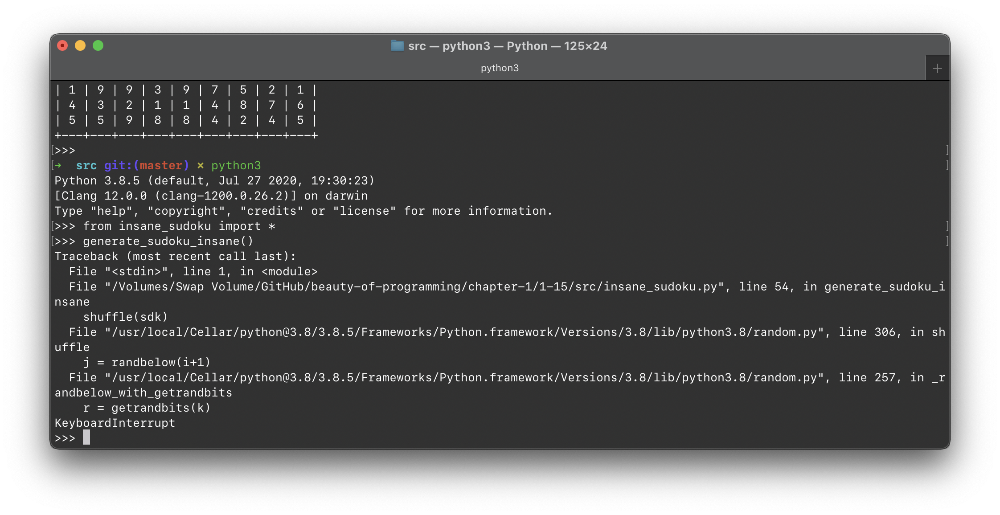
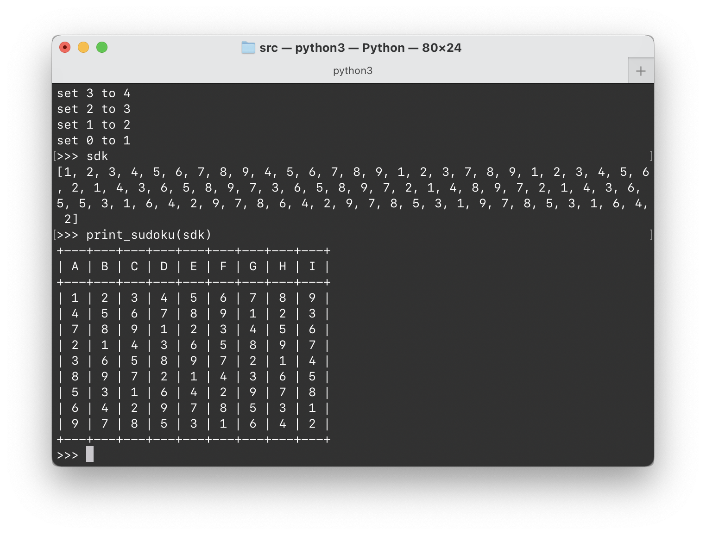
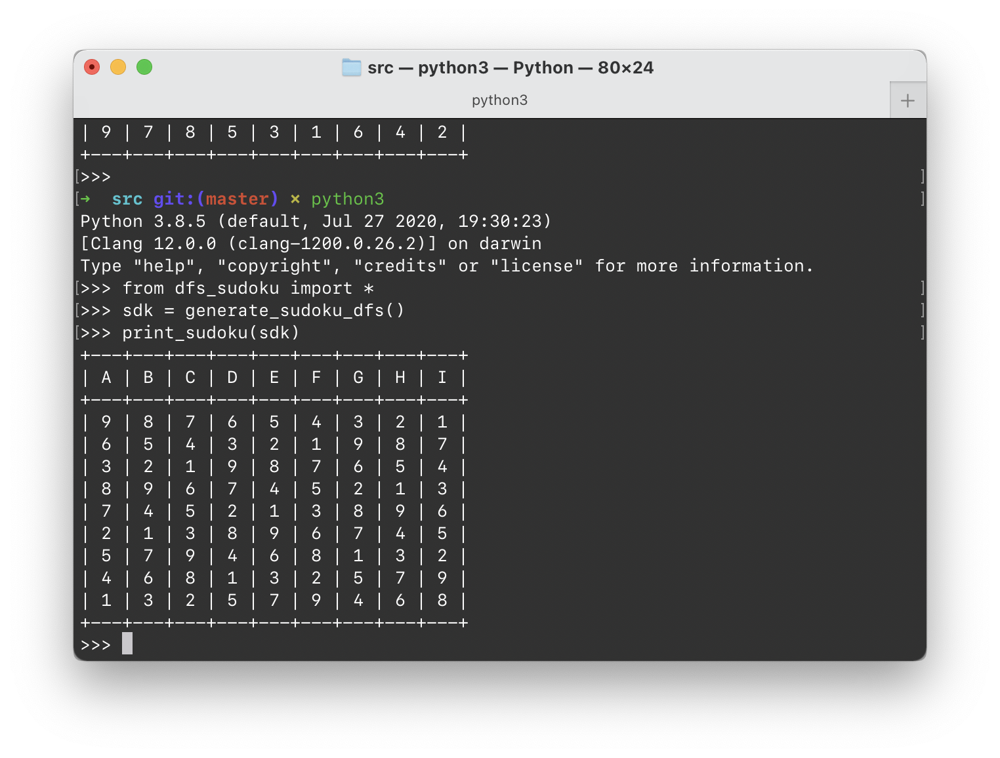

# 1.15 构造数独

## ★★★

数独（[数独／すうどく](https://zh.wikipedia.org/wiki/數獨)）是一个历史悠久、最近又特别流行的数学智力游戏。它不仅具有很强的趣味性，而且能锻炼我们的逻辑思维能力。数独的「棋盘」是由九九八十一个小方格组成的。玩家要在每个方格中，分别填上 1 至 9 的任意一个数字，让整个棋盘每一行、每一列、以及每个 $3 \times 3$ 的小矩阵中的数字都不重复。

据说「数独」游戏在日本非常流行，在地铁车厢和候车室里，每天都可以看到人们埋头于游戏的情景，甚至有专门的「数独游戏机」出现。

现在很多杂志和报纸上的游戏专版也有数独栏目，一般的方式是提供一个不完整的数独，让读者填完所有数字。

既然数独这个游戏这么好玩，我们也写一个吧！

---

回答基础的几个问题：

* 程序的大致框架？
* 用什么样的数据结构存储数独游戏中的各个元素？
* 如何生成一个初始局面？

## 解

这里，我们就不花时间在「程序框架设计」和「数据结构」上了。

我们用最不费脑子的 `int sudoku[81]` 来保存数独局面。

重点关心，如何生成一个正确的数独。

### Insane Solution

绝对不会有人用的解法：随机将 9 个「123456789」数码散布在数独格中，并检查他们是否构成一个数独。

```python
def generate_sudoku_insane() -> list:
    sdk = []
    for i in range(1, 10):
        sdk += [i] * 9

    count = 0
    while True:
        shuffle(sdk)
        if validate_sudoku(sdk):
            return sdk
        count += 1
        print("attempt %s..." % count, end='\r')
```

大概是不需要多尝试了——这样碰出来数独的概率非常之低——大概在 $10^{-20}$ 量级上。



不要写出这种代码。

### DFS

深度优先搜索：按照一定顺序（一般是从左到右、从上到下的顺序）填写格子；在发现某一个格子无论填写何值都无法使数独成立时，回溯到上一个格子换一种填法尝试。

> 总是填写尽可能小的数字的填法，生成的叫做「最小数独」。反之则得到「最大数独」。

> 这种方法不仅可以生成数独，还可以填写一个残缺的数独。

实现也是很简单的。



一个从左到右、从上到下的最小数独是这样的。

当然，也可以很容易改写以得到最大数独：



如果每次取值都 Shuffle 一下，那么就能得到更加变化多端的数独了：


这样，就可以得到非常可玩的数独了。

### Abstract

事实上，我们每得到一个数独，就可以通过任意交换 1 到 9 的全排列来生成另外 $9! - 1$ 个不同的数独。

当然，$9!$ 这个数量远远小于所有数独的数量。沧海一粟。

### Gameplay

理论上可以证明：给出数字少于 17 个的数独没有唯一的解。

因此我们在开发这个游戏时，不能够简单地判断「用户填写的数字是否是我们给出的？」，而是应该确切地进行「数独检查」，只要符合数独的要求，都算作是填写成功。

使用 `validate_sudoku(list) -> bool` 方法就好了。

## 跋

这是一个不是很常见的、「开发游戏」比「玩游戏」要简单的事例。类似的还有「扫雷」（DFS 思维教学）、「24 点」之类的游戏。

Mac App Store 中提供[数独](https://apps.apple.com/cn/app/%E6%95%B0%E7%8B%AC-%E5%81%A5%E8%84%91%E7%9B%8A%E6%99%BA%E6%B8%B8%E6%88%8F/id1496059499?mt=12)游戏。