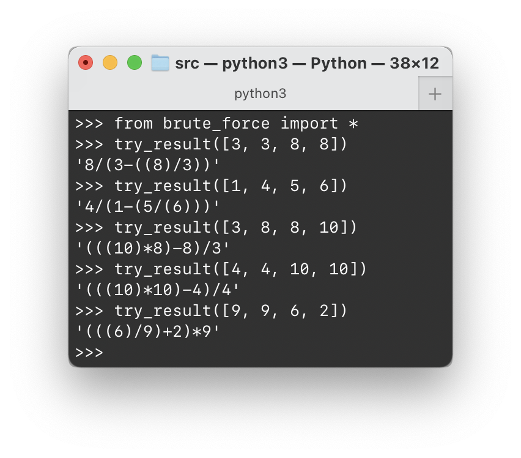

# 1.16 24 点游戏

## ★★★

24 点是一种老少咸宜的游戏，它的具体玩法如下：

给玩家四张牌，每张牌的面值在 1 到 13 之间（规定 J = 11、Q = 12，K = 13），允许其中有数值相同的牌。采用加、减、乘、除四则运算，允许中间运算存在小数，并且可以使用任意多的括号（任意改变求值顺序）。每张牌只能使用一次。

尝试构造一个表达式，使其运算结果为 24。

请你根据上述规则构造一个玩 24 点游戏的算法，要求如下。

* 输入：$n_1$、$n_2$、$n_3$、$n_4$。
* 输出：若能得到运算结果为 24，则输出一个对应的运算表达式。

例如：

* 输入：$11$、$8$、$3$、$5$。
* 输出：$(11 - 8) \times (3 + 5) = 24$。

## 解

### Recursively

递归 + 回溯。四个数字之间只可能用加减乘除四种运算结合起来，即一共只有 $4 ^ 3$ 种情况。同时因为可以任意加括号，本质上就是随意改变求值顺序，存在 $3!$ 种可能（虽然对于某些表达式，改变顺序并不会影响结果）。

> 其实，按照「符号一」、「符号三」、「符号二」的顺序计算和按照「符号三」、「符号一」、「符号二」的顺序计算，结果没有影响。对应的括号结合方式都是 $((A * B) * (C * D))$。（$*$ 代表任意运算。）
>
> 所以，实际上只有 $5$ 种情况。

因此对于某一种特定的数排，一共也就只有 $4^3 \times (3! - 1) = 320$ 种情况而已。

又因为数字可以任意改换排列顺序，即存在 $4! = 24$ 种排列顺序，所以总共的排列可能就是 $320 \times 24 = 7680$ 种。

那么，全部遍历一遍就好了。

注意，如果直接进行浮点运算可能导致精度问题。因为这里处理的都是有理数，所以采用 Python 的 `fractions`（有理数）库来进行运算。

我们可以用递归的思想来实现找 24 点的算法。因为，正巧要求的数字排列顺序无关，所以我们只要从中随机挑出一个数字 $V$，然后递归交给 `try_result`，并判断其是否能产生满足下列六种情况之一的 $R$ 即可。

> 其中，$T$ 为当前循环体中，所要产生的目标值。

六种情况分别为：

* $V + R = T$（和 $R + V = T$ 是一回事）
* $V - R = T$
* $R - V = T$
* $V \times R = T$（和 $R \times V = T$ 是一回事）
* $\dfrac V R = T$（在检查这种情况前，先确保 $T \ne 0$）
* $\dfrac R V = T$（在检查这种情况前，先确保 $V \ne 0$）

从上述六种情况中解出 $R$，就有下面这个很好的大 `if-else`：

```python
        if rsp := try_result(nums, target + spec):
            return "(%s)-%d" % (rsp, spec)
        if rsp := try_result(nums, spec - target):
            return "%d-(%s)" % (spec, rsp)
        if rsp := try_result(nums, target - spec):
            return "(%s)+%d" % (rsp, spec)
        if spec != Fraction(0):
            if rsp := try_result(nums, target / spec):
                return "(%s)*%d" % (rsp, spec)
        if target != Fraction(0):
            if rsp := try_result(nums, spec / target):
                return "%d/(%s)" % (spec, rsp)
        if rsp := try_result(nums, target * spec):
            return "(%s)/%d" % (rsp, spec)
```

> Walrus Operator 真可爱

其次，就是回溯了。如果将某一个数取出後找不出任何合理情况，则将其放回原处，重新选数字。如果所有的数字都失败，则返回 None 报告错误。

没有额外的空间开销。




> 注意：使用高精度有理数类型 `Fraction` 是必要的；否则会由于浮点精度问题而失败。

这里的函数实际上是泛泛的——没有限定多少个数字和目标点数。可以很容易地扩展到 $n$ 张牌、结果为 $m$ 的情况。也很容易在其中新增运算符。