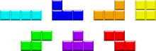
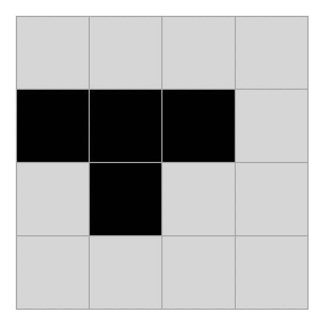
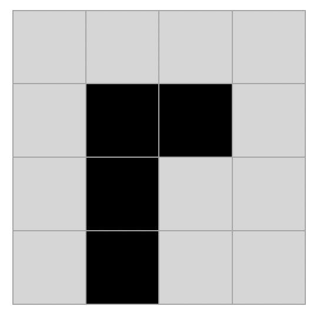
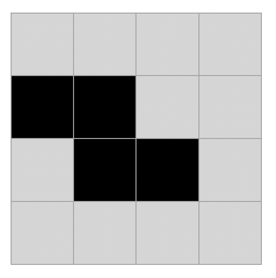
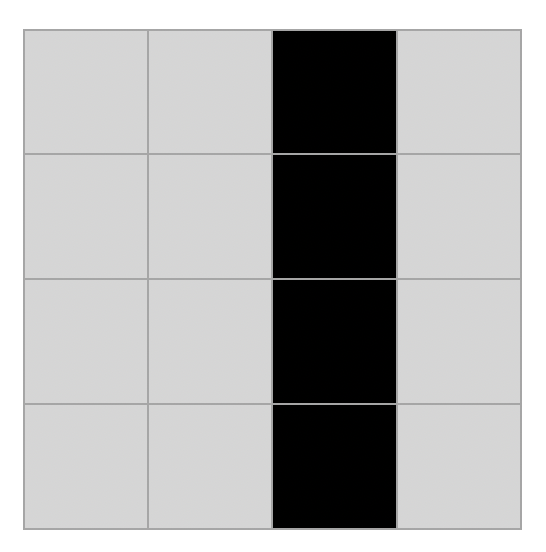
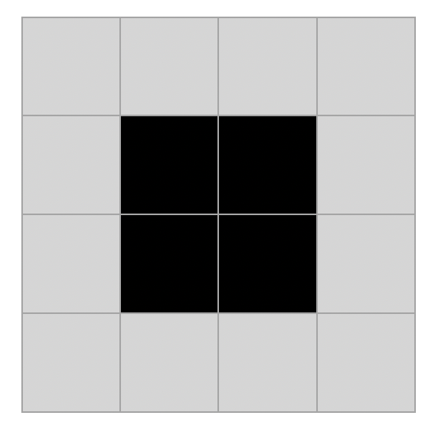
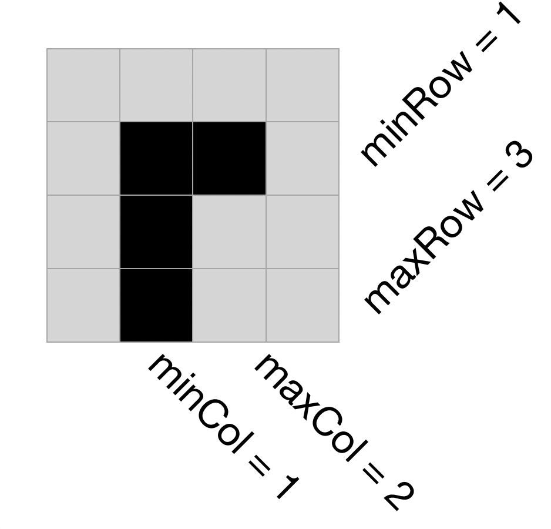

# 1.17 俄罗斯方块游戏

## ★★★

俄罗斯方块（Tetris）是从 20 世纪 80 年代开始风靡全世界的电脑游戏。

俄罗斯方块由下面几种形状的积木块组成：

他们的英文名代号（从左至右、上至下）分别为：I、J、L、O、S、T、Z。

具体的游戏规则如下：

* 积木块会从游戏区域上方开始缓慢落下。
* 玩家可以做的操作有：
	* 90 度旋转积木块
	* 左右移动积木块
	* 使积木块加速落下
* 积木块落到游戏区域最下方、或是落到其他积木上方无法移动时，就会固定在该处；然後新的积木块就会开始落下。
* 当游戏区域中的某一行格子全部由积木块填满，则该行会消失并且增加玩家的得分。一次清除的行数越多，得分越多。
* 积木堆到区域最上方时，游戏结束。

那么，作为一个游戏设计者，我们需要考虑的问题有：

* 如何设计各种数据结构来表示这个游戏的各种元素？如当前活跃的活动块、堆积在底层的块等。
* 已知底层积木的状态和当前新积木块的状态，如何据此来得到一种旋转、移位的方法，以最有效率地清除堆积的积木？
* 有些版本的 Tetris 游戏有一个预览窗口，可以看到下一块出现在顶部的积木。此时我们该如何修改游戏，才能利用这一信息来高效地清除积木？

## 解

### Data Structure

#### Fixed Blocks

首先，我们用一个二维数组来保存已经「固定位置」的积木块。因为他们已经不能活动、只能被用于消行，而且消行之後原来的块可能只剩一部分；所以，没有必要保留其原有的「块结构」。

直接用个二维数组  `bool area[M][N]` 来保存就好了。

#### Active Blocks

活跃积木块就稍微难处理一点了；主要问题在于：不同的块大小不一样大。虽然他们都只占用 4 个小方格，但是需要 $4 \times 4$ 的网格才能一致地表示所有积木块。

> 这里省略了第一、第二种积木的镜像对称形式。

放置的方式并不唯一。一共是 7 种不同类型的积木，我们提前将 7 种积木、4 种旋转方式的网格形式都用这种类型来表示。

例如，`typedef bool Grid[4][4]`，然後弄出 `Grid grid[7][4]` 来把所有的可能都记录下来。

> 当然这里是存在浪费的；有一些块只存在 1 种、2 种旋转方式，没有必要保存 4 种块。但是简单起见，我们就不做优化了；为了几个字节而已，不值得。

这样只会消耗 $4 \times 4 \times 7 \times 4 = 448$ 个 Bit，也就是 56 Byte。不是难以接受的空间消耗。

这样，我们就可以简单地用 `auto rotatedBlock = grid[n][m % 4]` 来得到旋转後的方块网格。（`n` 是方块形状 ID，`m` 是旋转次数。）

#### Hit Tests

如何判断一个块是否碰到了边缘、或是和其他块相撞了呢？

最直接的思路，边缘碰撞检测可以用 Hit Box 来做。因为这里的 $4 \times 4$ 网格不是任何一种方块的紧 Bound，因此不能用网格的坐标来判定。

但是，只要我们给出每一种方块的包围盒（最小、最大的 Column 坐标），就可以实现「不让方块跑出左、右限界」。

但是，对于一般的方块碰撞来说，这样做太粗糙了；因为包围盒判定方法只限于被碰撞一方是严格横平竖直的方正形状，才可行。

因此，我们可以更一般化地实现碰撞检测：

* 总是先进行要求的移动。
* 如果移动後的方块 Bit 集合和已有的固定块 Bit 集合有交集，则认定发生了碰撞。
* 否则，没有发生碰撞。

这样，只要在荧幕的左、下、右方向上填满特殊方块（只用于碰撞检测的），就可以实现越界避免了。

顺带一提，如果这个「移动」是由用户触发的，那么产生碰撞的移动就会被拒绝。

如果这个移动是由「定期下落事件」触发的，那么结果就是该方块不移动，并且成为「固定方块」的一部分。生成新的活跃方块。

#### Reshape

俄罗斯方块要允许「形状的改变」。但是，要考虑到其中的特殊情况。

例如，在一个井状通道中下落的 $1 \times 4$ 方块，要想将其变换为 $4 \times 1$ 的方块就做不到（容不下这种方块）。

除去这种很刻意的情况，还有，对于那些在变形之後宽度增加的方块，应该向哪边扩展？如果在变形前方块位于靠墙位，那么就可能表现出方块「被墙壁挤开」的情况。

总归…情况又多又复杂…要实现一个可玩的 Tetris，需要耗费一些时间和精力。