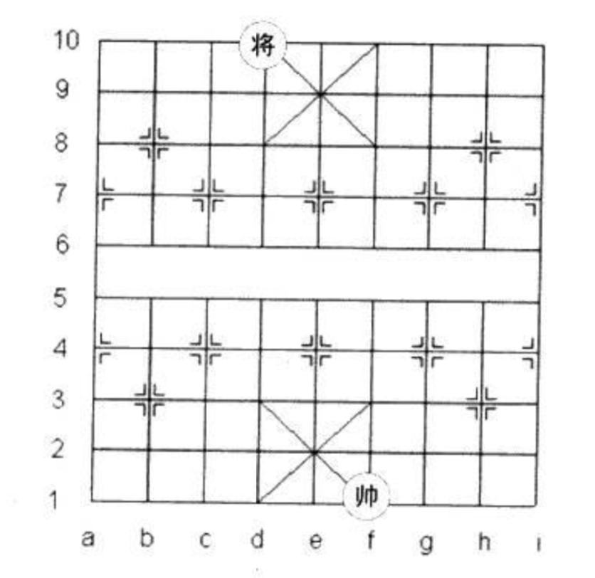

# 1.2 中国象棋将帅问题

## ★★★

下过中国象棋的朋友都知道，双方的「将」和「帅」相隔遥远，并且他们不能照面。

在象棋残局中，许多高手能利用这一规则走出精妙的杀招。

假设棋盘上之后「将」、「帅」二子（如图所示）。为了下面叙述方便，我们约定用 $A$ 表示「将」，$B$ 表示「帅」。



$A$、$B$ 二子被限制在己方 $3 \times 3$ 的格子里。例如，在如上的表格中，$A$ 被正方形 $\lbrace d_{10}, f_{10}, d_8, f_8\rbrace$ 包围，而 $B$ 被正方形 $\lbrace d_3, f_3, d_1, f_1 \rbrace$ 包围。每一步，$A$、$B$ 可以横向或纵向移动一格，但不能沿着对角线移动。

另外，$A$、$B$ 不可「打照面」的意思是两子不可处于同一纵向直线上。

请写出一个程序，输出 $A$、$B$ 的所有合法位置。要求在代码中只使用一个变量。

## 解

### Intuitive Solution

假如我们不考虑限制「只能使用一个变量」，那么这题还是相当简单的。

遍历每个子可以使用一个双层的 `for` 循环；将他们嵌套起来、并在此处处理「打照面」的情况，就好了。

```python
shared_x = ['d', 'e', 'f']

jiang_y = ['8', '9', '10']

shuai_y = ['1', '2', '3']

for s_x in shared_x:
    for j_x in shared_x:
        if j_x == s_x:
            continue

        for s_y in shuai_y:
            for j_y in jiang_y:
                print('將：(%s, %s)，帥：(%s, %s)' % j_x, j_y, s_x, s_y))

```

> 参见 `./src/intuitive.py`。

这里一共用到了 7 个变量——完全不可行。

但结果当然是对的，可以给我们后面的解答作参照。

### Bitwise Solution

#### 设计数据结构

说到底，我们花了太多的变量（4 个！）在保存将帅的位置上了。这四个变量就算往少了算也花费了 128 位（按 4 个 `Int32` 变量计算），而实际上我们最多只需要 5 位（$2^5 > 18$）就能分辨所有的情况。

> 就算我们用每个 Bit 来表示每一个可能所在的位置，那也只需要 18 位而已。

采用一个 8 位 `byte` 类型的变量来储存棋局情况，就足够了。

> Python 里，要构造一个定长的 `byte` 并不容易。咱们就先用 `int` 凑合一下吧。

然后，我们要怎么将她们对应到棋盘位置上才比较方便呢？

考虑到我们的变量只有 8 位，每个象棋所能分到的只有 4 个比特。

那么最简单的思路自然还是把九宫格从左上至右下使用 0 到 8 进行编号；像这样。

```
0 1 2
3 4 5
6 7 8
```

这样，我们就能以「对 3 同模」作为他们是否「打照面」的依据了。

#### 分离「将」、「帅」

我们把 8 位中的前四位分配给「将」、後四位分配给「帅」。

```
byte chessboard = 0000 0000
```

这样，我们就能通过

```python
# 获得低四位（0～3）
chessboard & 0xf
```

和

```python
# 获得高四位（4～7）
(chessboard >> 4) & 0xf
```

来获取帅和将的位置。

#### 判断照面

参考我们上面的数据结构设计，我们只需要判断将帅数对 3 取模是否一致…

```python
(chessboard & 0xf) % 3 == ((chessboard >> 4) & 0xf) % 3
```

…就可以判断他们是否位于同一纵线（打照面）了。

#### 遍历 chessboard

还有一个问题。我们怎么才能遍历每一种可能的 `chessboard` 情况呢？

别忘了我们不能使用任何其他变量了；我们的变量预算已经全部花在了这个精巧的 `chessboard` 上。

```python
while True:
    # 在遍历内层循环之前，先清零
    chessboard &= ~0xf
    while True:
        if (chessboard & 0xf) % 3 != ((chessboard >> 4) & 0xf) % 3:
            # this is a valid one!

        # 递增「帅」的位置
    	if chessboard & 0xf >= 8:
            break
            
        chessboard += 1

    if (chessboard >> 4) & 0xf >= 8:
        break
    
    # 递增「将」的位置
	chessboard += 0x10
```

#### 打印结果

「将」的格子索引和 0～8 的对应关系是：

```python
[(d, 10), (e, 10), (f, 10),
 (d, 9), (e, 9), (f, 9),
 (d, 8), (e, 8), (f, 8)]
```

所以 

```python
# 当然在代码里不可能用这么多变量…太浪费了。

jiang_x = (chessboard & 0xf) % 3
jiang_y = (chessboard & 0xf) // 3

shuai_x = ((chessboard >> 4) & 0xf) % 3
shuai_y = ((chessboard >> 4) & 0xf) // 3
```

对应的棋盘格列表分别是

```python
shared_x = ['d', 'e', 'f']

jiang_y = ['8', '9', '10']

shuai_y = ['1', '2', '3']
```

于是我们可以这样构造「将」的坐标位置…

```python
jiang_x_char = ['d', 'e', 'f'][(chessboard & 0xf) % 3]
jiang_y_char = ['8', '9', '10'][(chessboard & 0xf) // 3]
```

…和「帅」的坐标位置…

```python
shuai_x_char = ['d', 'e', 'f'][((chessboard >> 4) & 0xf) % 3]
shuai_y_char = ['1', '2', '3'][((chessboard >> 4) & 0xf) // 3]
```

最后，把他们打印出来就好了。

> 参见 `./src/bitwise_traverse.py`。

### Compare Evil Solutions

MSRA 里有两个人做出了代码又短、效率又高的解。请问谁的答案会比较快？

> 我插一句，这个 Solution #2（`./src/short_liner_2.cc`）简直就是作弊嘛。
>
> 他只让你用一个变量，结果你居然把多个变量塞到 `struct` 结构体里。
>
> 那我不是想用多少个就用多少个？

咱们就直接用 `time.h` 测一测吧？

结果如下：

```
... <results>
solution #1 time elapsed: 0.000153 s

... <results>
solution #2 time elapsed: 0.000096 s
```

多次试验可以看出，#1 的耗时的确比 #2 要长一些。

我们读一读他们的汇编？

> 读不懂…

看一下代码，可以大概猜出来原因。因为 #2 里面，在进行内层循环的时候，外层循环的 index 值是被保存着的。（保存在结构体里。）而在 #1 里面，每次都要反复计算一次。我想这是会变慢的。

## References

* https://blog.csdn.net/u011608357/article/details/20306609
* https://bbs.csdn.net/topics/310267652
* https://blog.csdn.net/Hello_Parasol/article/details/82177491