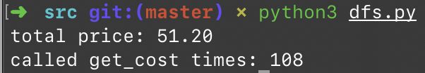
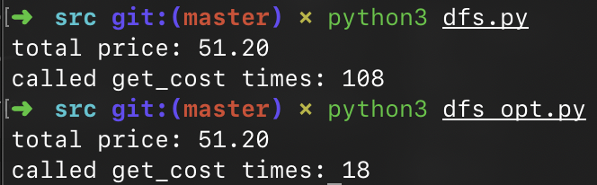
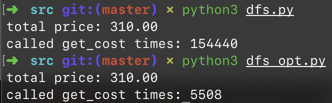

# 1.4 买书问题

## ★★★

在节假日的时候，书店一般都会做促销活动。

由于《哈利·波特》系列相当畅销，店长决定通过促销活动来回馈读者。在销售的《哈利·波特》平装本系列中，一共有五卷，用编号 0、1、2、3、4 来表示；假设每一卷单独销售需要 $8$ 欧元。如果读者一次购买不同的两卷，就可以扣除 $5\%$ 的费用；三卷则更多。

假设具体折扣的情况如下：

| 本数 |  折扣  |
| :--: | :----: |
| $2$  | $5\%$  |
| $3$  | $10\%$ |
| $4$  | $20\%$ |
| $5$  | $25\%$ |

在一份订单中，根据购买的卷数以及本数，可能会出现可以应用不同折扣规则的情况。但是，一本书只会应用一类折扣规则。

比如，读者一共买了两本卷一，一本卷二。那么，一本卷一和一本卷二可以享受到 $5\%$ 的折扣。另外一本卷一则不能享受折扣。

假如有多种应用折扣的办法，希望选择能使得总额尽可能低的那种。

要求根据以上需求，设计出算法，计算出读者所购买一批书的最低价格。

## 解

### Greedy(?)

当然最容易想到的解法就是，每次总是试图匹配包含本数更多的折扣。

可以很容易写出这样的贪婪匹配的代码：

```python
#!/usr/bin/env python

# greedy: is that correct?

books = [4, 2, 4, 5, 2]

per_price = 8

discounts = {
    5: 0.25,
    4: 0.2,
    3: 0.1,
    2: 0.05,
    1: 0.0
}

cost = 0.0

while sum(books):
    diff_kinds = sum([1 if v else 0 for v in books])

    if diff_kinds == 1:
        cost += max(books) * per_price
        break

    cost += per_price * diff_kinds * (1 - discounts[diff_kinds])
    books = [v - 1 if v > 0 else 0 for v in books]

print("total price: %.2f" % cost)
```

> 参见 `./src/greedy.py`。

我们以用例 `[2, 2, 2, 1, 1]` 来测试这部分代码，得到的结果是 €51.6。

贪婪匹配会先用 $25\%$ 的折扣购买五本书，花费 €30；然后用 $10\%$ 的折扣购买剩下的三本书，花费 €21.6。

然而我们只要稍作分析，就能发现我们的这 8 本书可以被分拆成两组、各 4 本不同的书，按这样的分组购买只需要花费 €51.2。

这种情况出现的表面原因是五本书所给的折扣不足；背后的原因是贪婪法则本身并不是一个普适性的法则，只是一个思考的方向。

### DFS

#### Exhaustion

好吧，既然上面我们的问题是「有的时候，得忍一手，不能总是凑最大折扣」。实际上，假设目前我们有的各异书本数量是 $k$，那么我们就有 $k$ 种选择：应用 $k$ 本书对应的折扣、$k - 1$ 本书对应的折扣、…、不应用折扣。

但是，同时也要考虑到，要从 $k$ 本书中拿出不同的 $k$ 本来凑成折扣，有 $C_k^k$ 种方法；但要拿出 $k - 1$ 本不同的书就有 $C_k^{k - 1}$ 种；以此类推，实际上的所有情况有
$$
\sum_{i = 1}^{k} C_k^i
$$
种。

我们按照穷竭的方法试着写出代码，可以看到输出了正确的结果。

> 参见 `./src/dfs.py`。



可以看到，在使用了 `lru_cache` 的情况下，调用 `get_cost` 的次数是 108 次。

这个数字在要买的书本数量不大的时候还可以接受，但是我们用一个稍大一点的输入（例如 ` (10, 9, 12, 11, 8)`），结果就暴增到了 154440 次。


#### Optimization

题设中说，《哈利·波特》的每一卷的价格是一样的（真是这样吗？），所以我们输入的 `tuple` 值的顺序是没有关系的；我们只关心互异的五本书的数值，而不关心他们实际对应的是哪本书。

因此，我们可以规定始终把 `tuple` 降序排列，而非降序排列的输入经过排序之后，和降序排列的情况没有区别；要买的依然是那几本数量的书。

经过这一优化之後，结果发现调用次数有了大幅提升。





#### Next Optimization

这里，我们还有进一步的优化空间。

假定我们的购书清单元组是 $(Y_1, Y_2, Y_3, Y_4, Y_5)$。根据我们上面的假定，可以规定 $Y_1 \ge Y_2 \ge Y_3 \ge Y_4 \ge Y_5$。