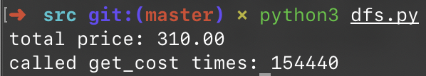

# 1.4 买书问题

## ★★★

在节假日的时候，书店一般都会做促销活动。

由于《哈利·波特》系列相当畅销，店长决定通过促销活动来回馈读者。在销售的《哈利·波特》平装本系列中，一共有五卷，用编号 0、1、2、3、4 来表示；假设每一卷单独销售需要 $8$ 欧元。如果读者一次购买不同的两卷，就可以扣除 $5\%$ 的费用；三卷则更多。

假设具体折扣的情况如下：

| 本数 |  折扣  |
| :--: | :----: |
| $2$  | $5\%$  |
| $3$  | $10\%$ |
| $4$  | $20\%$ |
| $5$  | $25\%$ |

在一份订单中，根据购买的卷数以及本数，可能会出现可以应用不同折扣规则的情况。但是，一本书只会应用一类折扣规则。

比如，读者一共买了两本卷一，一本卷二。那么，一本卷一和一本卷二可以享受到 $5\%$ 的折扣。另外一本卷一则不能享受折扣。

假如有多种应用折扣的办法，希望选择能使得总额尽可能低的那种。

要求根据以上需求，设计出算法，计算出读者所购买一批书的最低价格。

## 解

### Greedy(?)

当然最容易想到的解法就是，每次总是试图匹配包含本数更多的折扣。

可以很容易写出这样的贪婪匹配的代码：

```python
#!/usr/bin/env python

# greedy: is that correct?

books = [4, 2, 4, 5, 2]

per_price = 8

discounts = {
    5: 0.25,
    4: 0.2,
    3: 0.1,
    2: 0.05,
    1: 0.0
}

cost = 0.0

while sum(books):
    diff_kinds = sum([1 if v else 0 for v in books])

    if diff_kinds == 1:
        cost += max(books) * per_price
        break

    cost += per_price * diff_kinds * (1 - discounts[diff_kinds])
    books = [v - 1 if v > 0 else 0 for v in books]

print("total price: %.2f" % cost)
```

> 参见 `./src/greedy.py`。

我们以用例 `[2, 2, 2, 1, 1]` 来测试这部分代码，得到的结果是 €51.6。

贪婪匹配会先用 $25\%$ 的折扣购买五本书，花费 €30；然后用 $10\%$ 的折扣购买剩下的三本书，花费 €21.6。

然而我们只要稍作分析，就能发现我们的这 8 本书可以被分拆成两组、各 4 本不同的书，按这样的分组购买只需要花费 €51.2。

这种情况出现的表面原因是五本书所给的折扣不足；背后的原因是贪婪法则本身并不是一个普适性的法则，只是一个思考的方向。

### DFS

#### Exhaustion

好吧，既然上面我们的问题是「有的时候，得忍一手，不能总是凑最大折扣」。实际上，假设目前我们有的各异书本数量是 $k$，那么我们就有 $k$ 种选择：应用 $k$ 本书对应的折扣、$k - 1$ 本书对应的折扣、…、不应用折扣。

但是，同时也要考虑到，要从 $k$ 本书中拿出不同的 $k$ 本来凑成折扣，有 $C_k^k$ 种方法；但要拿出 $k - 1$ 本不同的书就有 $C_k^{k - 1}$ 种；以此类推，实际上的所有情况有
$$
\sum_{i = 1}^{k} C_k^i
$$
种。

我们按照穷竭的方法试着写出代码，可以看到输出了正确的结果。

> 参见 `./src/dfs.py`。


可以看到，在使用了 `lru_cache` 的情况下，调用 `get_cost` 的次数是 108 次。

这个数字在要买的书本数量不大的时候还可以接受，但是我们用一个稍大一点的输入（例如 ` (10, 9, 12, 11, 8)`），结果就暴增到了 154440 次。



#### Optimization

题设中说，《哈利·波特》的每一卷的价格是一样的（真是这样吗？），所以我们输入的 `tuple` 值的顺序是没有关系的；我们只关心互异的五本书的数值，而不关心他们实际对应的是哪本书。

因此，我们可以规定始终把 `tuple` 降序排列，而非降序排列的输入经过排序之后，和降序排列的情况没有区别；要买的依然是那几本数量的书。

经过这一优化之後，结果发现运算效率有了大幅提升。


> 参见 `./src/dfs_opt.py`。

#### Next Optimization

这里，我们还有进一步的优化空间。

假定我们的购书清单元组是 $(Y_1, Y_2, Y_3, Y_4, Y_5)$。根据我们上面的假定，可以认为 $Y_1 \ge Y_2 \ge Y_3 \ge Y_4 \ge Y_5$。

根据题意，只要是不同卷的书组合起来就可以享受折扣。具体是哪几卷，不要求。

所以，假设 $Y_4 \gt 0$，那么在购书清单里就至少有 4 种不同的卷宗。这样，我们买掉这一部分，问题就变化为 $(Y_1 - 1, Y_2 - 1, Y_3 - 1, Y_4 - 1, Y_5)$。

考虑到我们上面的购书清单是无序的，所以其他类似于 $(Y_1 - 1, Y_2 - 1, Y_3 - 1, Y_4, Y_5 - 1)$ 的可能就无需考虑了。

因此，对于每种状态我们需要最多考虑五种转移；即采用哪种折扣进行购买。

* $5 \times 8 \times (1 - 25\%) + F(Y_1 - 1, Y_2 - 1, Y_3 - 1, Y_4 - 1, Y_5 - 1)$，假如 $Y_5 > 0$；
* $4 \times 8 \times (1 - 20\%) + F(Y_1 - 1, Y_2 - 1, Y_3 - 1, Y_4 - 1, Y_5)$，假如 $Y_4 > 0$；
* $3 \times 8 \times (1 - 10\%) + F(Y_1 - 1, Y_2 - 1, Y_3 - 1, Y_4, Y_5)$；，假如 $Y_3 > 0$；
* $2 \times 8 \times (1 - 5\%) + F(Y_1 - 1, Y_2 - 1, Y_3, Y_4, Y_5)$，假如 $Y_2 > 0$；
* $8 + F(Y_1 - 1, Y_2, Y_3, Y_4, Y_5)$，假如 $Y_1 > 0$；
* $0$，假如 $Y_1 = 0$。（特殊的收尾情况）

不过注意，在递归地调用自己的时候，也要保证子参数列表的书单有序，即保证 $Y_1 \ge Y_2 \ge Y_3 \ge Y_4 \ge Y_5$。

这样，最多需要调用 `dfs` 的次数是 $O(Y_1 \times Y_2 \times Y_3 \times Y_4 \times Y_5)$。因此空间复杂度和时间复杂度同为 $O(Y_1 \times Y_2 \times Y_3 \times Y_4 \times Y_5)$。

### Fixed Greedy

我们来分析贪心策略失败的情况。

对于购书清单 `[2, 2, 2, 1, 1]` 来说，按照 5 + 3 的方式购买不如 4 + 4 购买好。

原因是根据给出的折扣来说，$5 \times 8 \times (1 - 25\%) + 3 \times 8 \times (1 - 10\%) \gt 4 \times 8 \times (1 - 20\%) \times 2$。

事实上我们可以在此处进行优化，分类讨论。

#### Classified

* 在买书的本数 $k \le 5$ 的情况下，直接按照给出的折扣买就好了。

* 在 $k \gt 5$ 时，我们应该忽略单本购买的情况，因为没有折扣。

  * 以 $k = 6$ 为例，可能被分解成 $4 + 2$ 本、$3 + 3$ 本、以及 $2 + 2 + 2$ 本的买法。
  * 对应的折扣分别是 $1.1$、$0.6$、和 $0.3$。

  > 注意，有一些给出的书单不能分拆成这样的各异集。我们考虑的是理论上的最大值。

根据类似的办法，我们从 $k = 6$ 一直讨论到 $k = 10$。得到的结果是：

#### Results

##### $k = 6$

|      | 可能的分解  | 对应的折扣                           |      |
| ---- | ----------- | ------------------------------------ | ---- |
| ★    | $4 + 2$     | $4 \times 20\% + 2 \times 5\% = 1.1$ |      |
|      | $3 + 3$     | $2 \times 3 \times 10\% = 0.6$       |      |
|      | $2 + 2 + 2$ | $3 \times 2 \times 5\% = 0.3$        |      |

##### $k = 7$

|      | 可能的分解 | 对应的折扣                            |
| ---- | ---------- | ------------------------------------- |
| ★    | $5 + 2$    | $5 \times 25\% + 2 \times 5\% = 1.35$ |
|      | $4 + 3$    | $4 \times 20\% + 3 \times 10\% = 1.1$ |

##### $k = 8$

|      | 可能的分解      | 对应的折扣                                    |      |
| ---- | --------------- | --------------------------------------------- | ---- |
|      | $5 + 3$         | $5 \times 25\% + 3 \times 10\% = 1.55$        |      |
| ★    | $4 + 4$         | $2 \times 4 \times 20\% = 1.6$                |      |
|      | $3 + 3 + 2$     | $2 \times 3 \times 10\% + 2 \times 5\% = 0.7$ |      |
|      | $2 + 2 + 2 + 2$ | $4 \times 2 \times 5\% = 0.4$                 |      |

##### $k = 9$

|      | 可能的分解  | 对应的折扣                                           |      |
| ---- | ----------- | ---------------------------------------------------- | ---- |
| ★    | $5 + 4$     | $5 \times 25\% + 4 \times 20\% = 2.05$               |      |
|      | $5 + 2 + 2$ | $5 \times 25\% + 2 \times 2 \times 5\% = 1.45$       |      |
|      | $4 + 3 + 2$ | $4 \times 20\% + 3 \times 10\% + 2 \times 5\% = 1.2$ |      |
|      | $3 + 3 + 3$ | $3 \times 3 \times 10\% = 0.9$                       |      |

##### $k = 10$

|      | 可能的分解          | 对应的折扣                                     |      |
| ---- | ------------------- | ---------------------------------------------- | ---- |
| ★    | $5 + 5$             | $2 \times 5 \times 25\% = 2.5$                 |      |
|      | $4 + 4 + 2$         | $2 \times 4 \times 20\% + 2 \times 5\% = 1.7$  |      |
|      | $4 + 3 + 3$         | $4 \times 20\% + 2 \times 3 \times 10\% = 1.4$ |      |
|      | $2 + 2 + 2 + 2 + 2$ | $5 \times 2 \times 5\% = 0.5$                  |      |

#### Generalization

折扣的规则只关于 2 本到 5 本的情况。对于大于 10 本的情况，我们提出下面的假设：

在分解的过程中，可以找到如下的一种分法：可以把 10 本以上的书籍，分拆成小于 10 本的 $n$ 组，记为 $(X_{11}, X_{12}, X_{13}, X_{14}, X_{15})$、$(X_{21}, X_{22}, X_{23}, X_{24}, X_{25})$、……、$(X_{n1}, X_{n2}, X_{n3}, X_{n4}, X_{n5})$；并且全局的最优解就是每一小组的最优解的简单和。

> 这正确吗？

换句话来说，如果我们的贪婪策略得到的买书分解中出现了上面的非最优分解组合（不带★的那些），那么就可以通过在不改变 $k$ 的情况下来拿到更大的折扣。