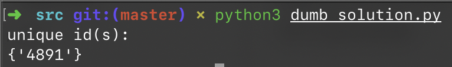

# 1.5 快速找出故障机器

## ★★

关心数据挖掘和搜索引擎的程序员都知道，我们需要很多的计算机来存储和处理海量的数据。然而，计算机难免会有硬件故障而导致网络连接失败或死机。为了保证搜索引擎的服务质量，我们需要保证每份数据都有多个备份。

为了简单起见，我们假设一个机器仅储存一个标号为 ID 的记录（假设 ID 是小于 $10^9$ 的整数）。
假设每份数据保留两份备份，这样就有了两台机器储存了同样的数据。

1. 在某个时间，如果得到一个数据文件 ID 的列表，是否能够快速地找出这个表中仅出现一次的 ID？

2. 如果已经知道只有 1 台机器死机（也就是说只有 1 个备份丢失）呢？如果有 2 台机器死机呢（假设同一个数据的两个备份不会同时丢失）？

## 测试用例

选定用 $[1, N]$ 内的所有整数为我们的备份数据。用两个 `List[int]` 数组来模拟我们的两台备份机器。

使用 `./src/gen_random.py` 来模拟生成随机数。

## 解

### Dumb Solution

首先，我们能想到最简单的解决方案就是利用一个 `set` 集合来记录遍历过的 ID、另一个来记录（当前）仅出现一次的 ID。假如遇到重复的 ID，则将其从 `uniqueID` Set 中移除。

这样遍历一次的时间复杂度是 $O(N)$；空间复杂度同样是 $O(N)$。

### Optimization #1

在上面的 Dumb Solution 中，我们用了两个集合来分别保存已经出现过的 ID 和（目前）只出现过一次的 ID。

然而题干中有一点保证：一个 ID 至多出现两次。所以，我们在遇到重复数据时，直接把它从当前集合中剔除即可；因为他不会再出现第三次。最后剩在集合中的就一定是恰好出现 1 次的 ID。

此时的时间复杂度仍然是 $O(N)$；而在最坏情况下所占用的空间是 $O(\frac N 2)$，仍然是 $O(N)$ 级别的。

> 参见 `./src/alittle_dumb_solution.py`。

### Optimization #2

异或（⊕）操作的真值表是：

|       | True  | False |
| ----- | ----- | ----- |
| True  | False | True  |
| False | True  | False |

因此假如 $A = B$，那么 $A ⊕ B = 0$。如果我们把所有的数字都进行一次 ⊕，那么所有出现两次的数字都会「两两抵消」，最后留下的就是唯一一个出现 1 次的 ID。

这样的空间复杂度就降低到了 $O(1)$。

> 参见 `./src/xor_solution.py`。

但是这个方法只能处理「只有唯一一个 ID 丢失」的情况。如果有两个不同的 ID 丢失，那么就只能得到 $id_1 ⊕ id_2$，而不知道那两个 ID 具体是什么。

### Optimization #3

在我们拿到了 $id_1 ⊕ id_2$ 之后，该怎么较有效率地找出 $id_1$ 和 $id_2$ 呢？

由于保证两个相同 ID 不会同时丢失，所以 $id_1 \ne id_2$，即 $id_1 ⊕ id_2$ 的所有二进制位不全为 $0$。所以我们一定能从 $id_1 ⊕ id_2$ 中找出一个二进制位，其值为 $1$。

也就是说，$id_1$ 和 $id_2$ 的这一位一定不一样（参见异或的真值表）；一个是 $0$，一个是 $1$。

那么我们就可以把所有的数字按照此位是 $0$ 还是 $1$ 分成两组，而 $id_1$ 和 $id_2$ 一定分属两组。

这样，对每一组来说，问题就简化成上面讨论过的情况了。

## 扩展

这个问题的本质也是从一堆数字中找到丢失的一个数字的问题。

时间复杂度通常都在 $O(N)$ 级别没跑了，但可以考虑考虑怎么优化空间复杂度（毕竟对于海量数据来说这是一个问题。）

