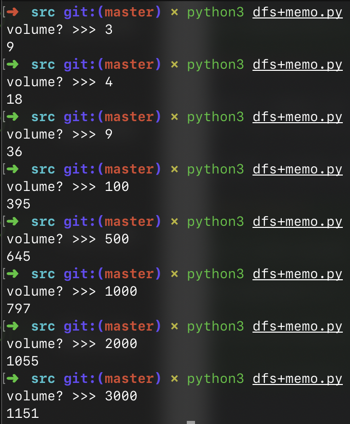

# 1.6 饮料供货

## ★★★

在微软亚洲研究院上班，大家早上来的第一件事是干啥呢？查看邮件？No，是去水房拿饮料：酸奶、豆浆、绿茶、王老吉、咖啡、**可口**可乐……（当然，还是有很多同事把拿饮料当做第二件事）。

管理水房的阿姨们每天都会准备很多的饮料给大家。为了提高服务质量，他们会统计大家对每种饮料的满意度。一段时间後，阿姨们已经有了大批的数据。某天早上，当实习生小飞第一个冲进水房并一次拿了五瓶酸奶、四瓶王老吉、三瓶鲜橙多时，阿姨们逮住了他，要他帮忙。

从阿姨们统计的数据中，小飞可以知道大家对每一种饮料的满意度。阿姨们还告诉小飞，STC（*Smart Tea Corp*）负责给研究院供应饮料，每天的总量（总容量）为 $V$。STC 很神奇，他们提供的每种饮料之单个容量都是 $2^n$，比如王老吉，都是 $2^3 = 8$ 升的，**可口**可乐都是 $2^5 = 32$ 升的。当然 STC 的存货也是有限的，这会是每种饮料购买量的上限。统计数据中用饮料名字、容量、数量、满意度来描述每一种饮料。

那么，小飞如何完成这个任务，求出保证最大满意度的购买量呢？

## 解

### Abstraction

我们先数学化地表述一下这个问题吧？

根据上面的表述，研究院每天需要购买的饮料总容量为 $V$。而每种饮料具有五枚属性，用元组 $(S_i, V_i, C_i, H_i, B_i)$ 来表示。

其中 $S_i$ 代表饮料的名字；$V_i$ 表示饮料的容量；$C_i$ 表示 STC 所能供应的最大库存；$H_i$ 代表饮料的满意度；$B_i$ 代表当前的实际购买量。

「可能的最大数量」指的是如果只购买某种饮料的话，最大可以买多少数量。这一数字受到 STC 供货和冰柜大小的双重制约。例如对于第 $i$ 种饮料，可能购买的最大数量是 $\min \lbrace \frac {V} {V_i}, C_i \rbrace$。这个数字和给定的冰柜大小 $V$ 有关，因此不应将其和饮料种类硬编码到一起。

因此，我们这么设计数据结构：

```python
class Drink:
    name = ""
    volume = 0
    max_amount = 0
    satisfactoriness = 0.0
```

> 参见 `./src/drinks.py`。

因此，当前购买的所有饮料占用的总容量是 $\sum_{i=0}^{n-1}(V_i \times B_i)$；总满意度是 $\sum_{i=0}^{n-1}(H_i \times B_i)$。

因为研究院的冰柜最多只能存放容量为 $V$ 的饮料，所以我们的目的是在保证 $\sum_{i=0}^{n-1}(V_i \times B_i) \le V$ 的基础上，使 $\sum_{i=0}^{n-1}(H_i \times B_i)$ 尽可能大。

### Dynamic Programming

动态规划法很适合这种「最优化」问题。

我们用 $Opt(V', i)$ 来表示当总体积不超过 $V'$ 的情况下、从第 $i$、$i + 1$、$i + 2$、…、$n - 1$、$n$ 种饮料中，算出所有方案中满意度之和的最大值。

显然，最后的结果由 $Opt(V, 0)$ 给出。

那么，我们可以给出这样的递归公式：
$$
Opt(V', i) = \max \lbrace k \times H_i + Opt(V' - V_i \times k, i - 1) \rbrace
$$
其中 $k$ 取 $[0, C_i]$ 内的任意整数，$i$ 取 $[0, n - 1]$ 内的任意整数。

此动态规划需要给出以下边界条件：

$Opt(0, n) = 0$。

即在冰柜容量为 $0$ 时，最优的结果也是 $0$。

$Opt(x, n) = -\inf,\ x \ne 0 $。

即在容量不为 0 的情况下，将初始值设定为 $-\inf$。

根据上面的推导公式，比较容易写出 DP 代码。

> 参见 `./src/dp.py`。


> 根据这里的运行结果，可以明显地发现限制条件的变化。
>
> 一开始，限制条件是冰柜的大小——在冰柜容量小于 4 的时候，只够存放 1 单位的「王老吉」，对应满意度为 9；
>
> 随后，随着冰柜数量渐渐增大，满意度逐渐增加；直到最后，研究院的冰箱大到可以装下 STC 所有的供货；此时满意度达到最大值，即 1151。

我们的算法开了一个 $(V + 1) \times (N + 1)$ 大小的动态规划表（$N$ 为饮料的数量），因此空间复杂度就是 $O(V \times N)$；而时间复杂度在 $\Omega (V \times N \times \min \lbrace C_i \rbrace)$ 和 $O(V \times N \times \max \lbrace C_i \rbrace)$ 之间。

鉴于我们只需要得到对应每个冰柜体积 $V'$ 的最大满意度，我们只需要保留每个冰柜体积中满意度最大的那一项值，这样空间复杂度可以降低到 $O(V)$。

### Think it over

这题其实给了一些障眼法。因为实际上，「满意度」给了我们一种错觉，好像是个统计数值一样。

然而，这里的满意度只是简单的可叠加，跟体积、数量没有什么大的区别。

实际上，所谓「满意度」也就是研究院冰柜中，每单位数量饮料的价值。

我们的目的就是在冰柜容量有限的情况下，尽可能提高所有饮料的总「价值」。

额外的，每种商品（饮料）可以买多个，然而不得超过 STC 的进货限制。

本质上也就是一个背包问题……而已。

### Memo Solution

上面的 DP 法实际上有些浪费：在 $V$ 远大于 STC 所能提供的所有饮料的总体积时，DP 表中会存在许多无意义的重复内容。

如果我们直接选择使用 DFS + Memo 的方案会更好。

直接用 Hash Map 来存放 Memo 也未尝不可；但对 Python 来说，直接对求解函数应用注解 `@lru_cache` 更为简单便捷。

用 DFS 相对要比 DP 更直观：我们做的事情只不过是遍历所有在当前体积下、可以购买第 `typee` 种饮料的可能性次数，并依次往后推。最终能取的最大值就是结果。

为了减少重复运算，采用 LRU Cache 来记录得到的结果。

> 参见 `./src/dfs+memo.py`。



### Tricky Solution

仔细审视一下题目的条件…我们会发现一个怪异的、没有被用到的条件。

那就是所有饮料容积都是 $2$ 的整数次幂。

这个条件能如何简化计算呢？我们把信息整理一下，把所有的饮料按照单位容积进行降序排序：

```python
print(sorted(drink_list, key=lambda v: v.volume, reverse=True))
```

得到的结果是：

```python
[
    Drink(name=可口可乐, volume=32, max_amount=25, satisfactoriness=10), 
    Drink(name=纯净水, volume=32, max_amount=42, satisfactoriness=8), 
    Drink(name=王老吉, volume=8, max_amount=10, satisfactoriness=8), 
    Drink(name=鲜橙多, volume=4, max_amount=15, satisfactoriness=7), 
    Drink(name=花露水, volume=4, max_amount=5, satisfactoriness=4), 
    Drink(name=酸奶, volume=2, max_amount=40, satisfactoriness=9),
    Drink(name=牛奶, volume=1, max_amount=10, satisfactoriness=4)
]
```

现在考虑我们的目标容积 $V$。从一开始，假如我们的 $V \mod 2^1$ 非 0，那么为了填满这种空位，我们必须至少购买一瓶容积为 $2^0$ 的饮料。那么，我们当然应该（贪婪地）购买满意度最高的那一种了。

但是，假如我们 $V \mod 2^2$ 非 0，那么我们不光考虑到可以购买一单位的 $2^1$ 饮料，还可以使用双倍的 $2^0$ 饮料组合起来，选出其中满意度最高的组合。

其实我们可以直接把剩余的 $2^i$ 个饮料进行组合，直接和 $2^{i + 1}$ 级别的饮料进行比较。

不过要注意 STC 的库存问题。

## References

* https://www.cnblogs.com/superxuezhazha/p/5746922.html
* https://blog.csdn.net/mengxiangjia_linxi/article/details/78153115
* https://blog.csdn.net/weixin_38483589/article/details/84147376