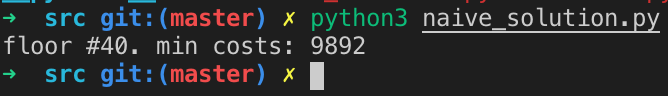
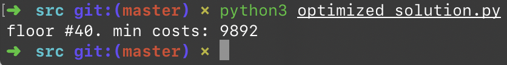

# 1.8 小飞的电梯调度算法

## ★★

MSRA 所在的希格玛大厦一共有 $6$ 部电梯。在高峰时间，每层都有人上下，电梯在每层都停。

实习生小飞常常会被每层都停的电梯弄得很不耐烦，于是他提出了这样一个办法：

由于楼层并不太高，那么在繁忙的上下班时间，每次电梯从一层往上走时，我们只允许电梯停在其中一层。所有的乘客都从一楼上电梯，到达某层楼後，电梯停下来，所有乘客再从这里爬楼梯到自己的目的层。在一楼的时候，每个乘客选择自己的目的层，电梯则自动计算出应停的楼层。

问：电梯停在哪一层楼，能够保证这次乘坐电梯的所有乘客爬楼梯的层数之和最少。

## 解

### Test Cases

我们随机设定楼层高度为 $[50, 100]$ 之间的任意整数；一次乘梯人数为 $[300, 500]$ 之间的任意整数。

特别地，我们忽略掉想要去 $1$ 层的人（因为题目设定，电梯从底层往上走）；测试用例中不会有想去 $1$ 层的人。

> 参见 `./src/testcases.py`。

### Naïve Solution

最简单（不过脑子）的办法当然就是遍历每一种停靠方式，并计算出其中乘客爬楼数最少的那一种。

不过我们可以选择只在最低目的层和最高目的层之间进行遍历，因为在此范围之外的层数都一定更 Costly。

> 参见 `./src/naive_solution.py`。

权当参照吧。

可以简单地发现，时间复杂度会达到 $O(M \times N)$，其中 $M$ 是楼层跨度，$N$ 是乘梯人数。



### Optimized Solution

上面的解法当然没有任何实际价值。最多拿来作为验证优化解是否正确的基准。

主要原因是许多次的遍历都是无意义的——大部分时候我们都会从很大的糟糕解过渡到最优解，然后再次偏移到一个很差的解。在此过程中我们还无能为力——完全不知道把电梯停到更高一层会带来什么结果——是让更多人能少爬一些上楼梯，还是让更多的人必须多爬一些下楼梯。

如何量化这种主观的感觉呢？

假设当前电梯停在 $i$ 层楼。根据上面的解法可以轻松解出需要爬楼梯的层数。

```python
sum([abs(i - floor) for i in reqs])
```

假如在这 $N$ 个乘客之中，有 $N_1$ 个乘客目的楼层在 $i$ 层以下，$N_2$ 个乘客目的楼层在 $i$ 层以上；还有 $N_3$ 个乘客的目的楼层刚好是 $i$ 层。

那么，当我们改停电梯到 $(i - 1)$ 层的时候，$N_1$ 个乘客可以少爬 $1$ 层（这其中已经包含了目的地就在 $i - 1$ 层的乘客）；$N_2 + N_3$ 个乘客则被迫需要多爬一层。

反过来，改停电梯到 $(i + 1)$ 层时，$N_2$ 个乘客可以少爬一层，而 $N_1 + N_3$ 个乘客则要多爬一层。

这样，在 $N_1 > N_2 + N_3$ 的时候，我们就该把电梯赶紧往下停一层；在 $N_2 > N_1 + N_3$ 的时候，我们就该把电梯往上停一层。两种情况都不满足的话，就该把电梯停在 $i$ 层。

> 这两个条件显然不会同时满足。

考虑到在将电梯往上停一层之後，$N_1$ 一定会增大，$N_2$ 一定会减小；且新 $N_3$ 一定小于之前的 $N_2$（因为他们在上移之前都归类在 $N_2$ 里）。这样，$N_1 > N_2 + N_3$ 在做这种变换之後一定也会成立；因为上移的本质是把一部分 $N_2$ 和全部的 $N_3$ 赋予 $N_1$，并将剩余的那一部分 $N_2$ 作为新的 $N_3$。

进一步，我们可以推知，假如对于楼层 $i$， $N_1 > N_2 + N_3$ 成立，那么对于任何更上层的 $i$ 他都会成立；往下移动同理。

因此，将满足 $N_1 > N_2 + N_3$ 的楼层放入集合 $A$；将满足 $N_2 > N_1 + N_3$ 的楼层放入集合 $B$；显然集合 $A$ 是形如 $[i_a, i_{max}]$ 的区间，而集合 $B$ 是形如 $[i_{min}, i_b]$ 的区间。

这两个区间一定没有交集；所以我们只要找出不属于两个集合的 $i$ 即可；假如两个集合的并集覆盖了全部楼层，那么两个集合的任何一个边缘都可以作为最值取。

首先我们花费 $O(N)$ 时间使用 `collections.Counter` 把原始数据分解成「想要去每层的乘客个数」。然后，根据上面的思路，我们只需要从底层往上遍历一次所有楼层即可找出极值。



根据这个方法，我们可以把时间复杂度压缩到 $O(M + N)$。

> 参见 `./src/optimized_solution.py`。

## 跋

### Extras

众所周知，爬上楼比起爬下楼要费力。假设爬上一层楼要费 $k$ 单位的力气，而爬下一层楼只需要费 $1$ 单位的力气。那么如何修改我们的电梯调度算法，使得大家都最省力？

### Answer

对于上面的两个解法来说，都非常容易改写以适应这种情况。

Naïve Solution 可以在求总 Cost 的时候分别计算上楼下楼的情况；

而 Optimized Solution，也可以通过调整公式为 $N_1 > k \times (N_2 + N_3)$ 和 $k \times N_2 > N_1 + N_3$ 来适应这种情况。

代码就不写了。