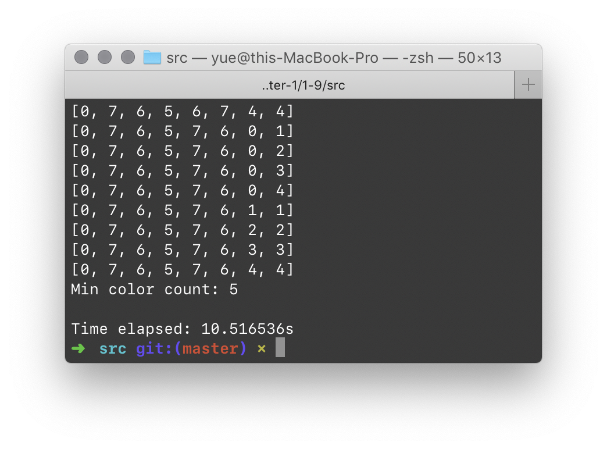
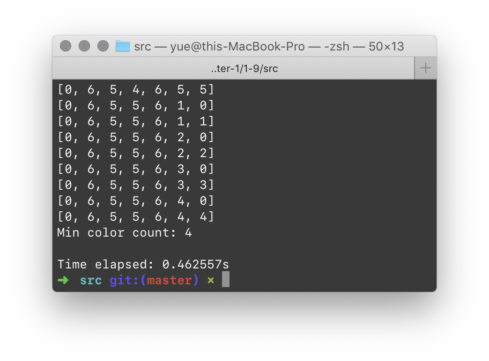
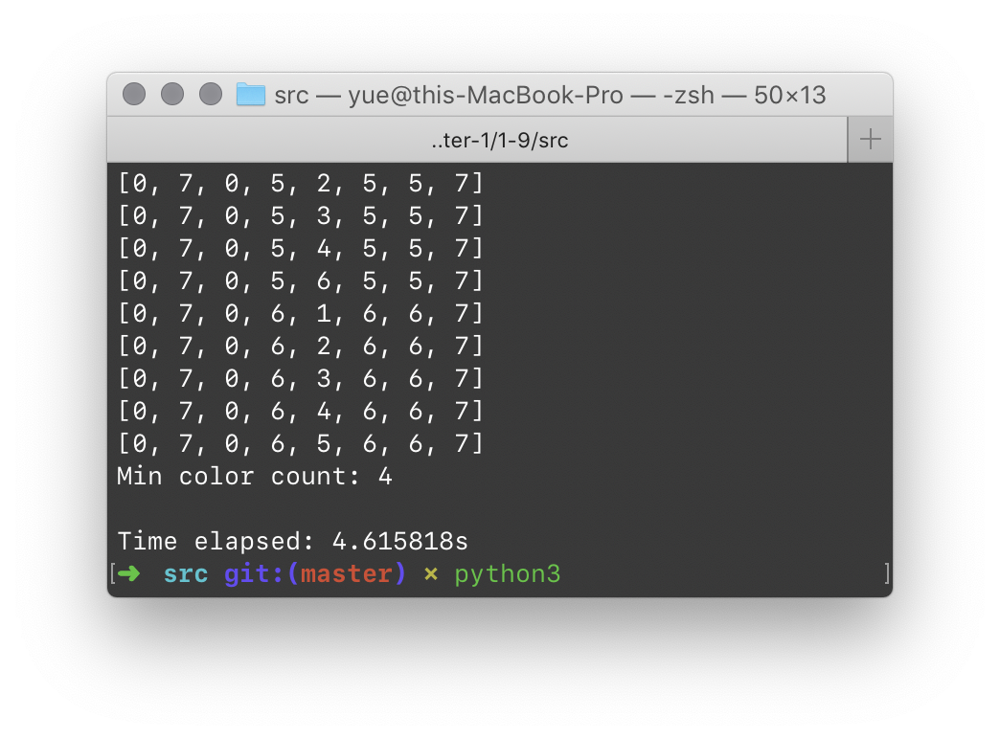

# 1.9 高效率地安排见面会

## ★

在校园招聘的季节里，为了能让学生们更好地了解微软亚洲研究院各研究组的情况，HR 部门计划为每一个研究组举办一次见面会，让各个研究组的员工跟学生相互了解和交流。

已知有 $n$ 位学生，他们分别对 $m$ 个研究组中的若干个感兴趣。为了满足所有学生的要求，HR 希望每个学生都能参加自己感兴趣的所有见面会。如果每个见面会的时间都为 $t$，那么，如何安排才能使得所有见面会的总时间最短？

最简单的办法，就是把 $m$ 个研究组的见面会时间依次排开，那我们就要用 $m \times t$ 的总时间，我们有 10 多个研究小组，时间会拖得很长，能否进一步提高效率？

## 解

### Graph Coloring

首先，考虑到「把所有 $m$ 个见面会的时间依次排开」这种情况。为了减少用的总时间，就应该把某些见面会的时间重叠起来。

考虑到每场见面会的时间都是 $t$，因此可以认为 $t$ 就是时间安排的最细粒度；更小粒度的错开只会浪费时间。

我们将问题简化为，对每一个 $t$ 时间，从未安排的见面会中抽取若干个，安排在这个时间段内。注意，如果有一位同学需要参加两场见面会，那么这两场见面会就不能安排在同一时间内。

这个问题可以显然地转化为一个图着色问题：将每位同学需要参加的所有宣讲会都用边连接（意味着他们不可以被上同一种颜色，即不可以安排在同一时间段）；然后，用最少的颜色对这张图着色。

> 遗憾的是图的最少着色问题并不那么容易解决。GCP 是一个经典的 NP-C 问题。

### Test Cases

咱们先写几个测试用例吧。

`gen_random` 函数接受（学生个数、见面会个数）作为参数，生成所有学生各自感兴趣的见面会 ID。

> 参见 `./src/testcases.py`。

### Brute Force

先拍脑袋写个暴力解法，给後面的优化方法做参考吧。

假设有 $M$ 个顶点（即 $M$ 个见面会）。对第一个顶点分配颜色 #1，然后对剩下的 $M - 1$ 个顶点枚举所有颜色可能，一一验证每种配色是否能够满足我们的要求。如果能满足，记录下使用颜色的种类。

注意到可能的最多颜色种类也就是 $M$ 种，因此枚举次数是 $O((M - 1)^M)$ 级别的。而每次枚举需要进行的验证耗时是 $O(M^2)$。因此总时间复杂度是惊人的 $O((M - 1) ^ M \times M^2)$。

顺便，可以采用上界和下界进行剪枝（还记得烙饼吗？）的办法来稍作优化。但总的来说，这种解法还是很慢很慢很慢。

#### Validation

```python
def check_valid(colors: list) -> bool:
    # check if it's a valid palette
    for conflicts in test_cases:
        results = [colors[i] for i in conflicts]
        if len(set(results)) != len(conflicts):
            # conflict exists!
            return False

    return True
```

只要分析一下每个 Conflict Set 的冲突就好了。

#### Color Counting

```python
def get_color_count(colors: list) -> int:
    # get different color counts in a palette
    return len(set(colors))
```

更简单了。

> 参见 `./src/brute_force.py`。

#### Results

复杂度的确是挺糟糕的。Python 版本无剪枝的实现相当慢；8 节点着色耗时会达到 10 秒以上。





相比之下，7 节点着色耗时仅为 $0.4$ 秒。

### Brute Force (Optimized)

这里仅仅采用最简单的剪枝法：在某个 Palette 的颜色个数多于当前最优解的个数的时候，不去 Validate 这种颜色，因为就算这是一个合法的 Palette，也绝不会是一个最优解。

这样优化的 8 节点着色时间大概能砍一半。



> 参见 `./src/brute_force_opt.py`。

### Coloring Solution

另一种方法就是尝试对图进行 $K$ 着色；将 $K$ 从 1 开始逐渐增大，直到找到一个可进行着色的 $K$ 值。

在求解图的最少着色数远小于图的顶点数的时候，耗时将会比 Brute Force 解短很多。

时间复杂度看运气。

### Intuitive Solution

启发式算法不一定能找出最优解，这就不说了。

要复习的话，去看「Compilers」的 Register Allocation Lab。

# 1.9.1 高效率地安排面试

## ★★

见面会之後，正式的面试就陆续开始进行了。某一天，在微软亚洲研究院有 $N$ 个面试要进行，他们的起讫时间以元组 $(B[i], E[i])$ 表示。

假设一个面试者一天只参加一场面试。为了给面试者提供一个安静的、便于面试者发挥的环境，我们希望把这 $N$ 个面试安排在若干个面试点中。当然，时间有重叠的面试不能安排在同一场地。

现在给定这 $N$ 个面试的时间，计算出最少需要的面试点的个数，同时给出一个可行的方案。

### Brute Force

这题同样也是一个可用图模型求解的问题；只需要花 $O(N^2)$ 的时间就可以构造出一张图。

但是，根据我们上面的解法，找不到一个精确、稳定的多项式时间解法。

### Greedy

这题的关键在于，每一场面试都对应一个时间区间。由时间区间之间的约束关系转化得到的图，被称为区间图。

区间图相比于平凡的图来说，有更强的性质：可以使用贪心策略来解决。

思路很简单：对于所有的面试 $I[i] = (B[i], E[i])$，按照 $B[i]$（起始时间）从小到大排序，然后按顺序对各个区间着色。

对当前区间 $i$ 着色时，只需要保证选择的颜色没有被出现在靠前、且和当前区间 $i$ 有重叠的区间所用即可。

这种操作只需要花费 $O(N \log N)$ 的时间。

> 参见 `./src/greedy.cc`。